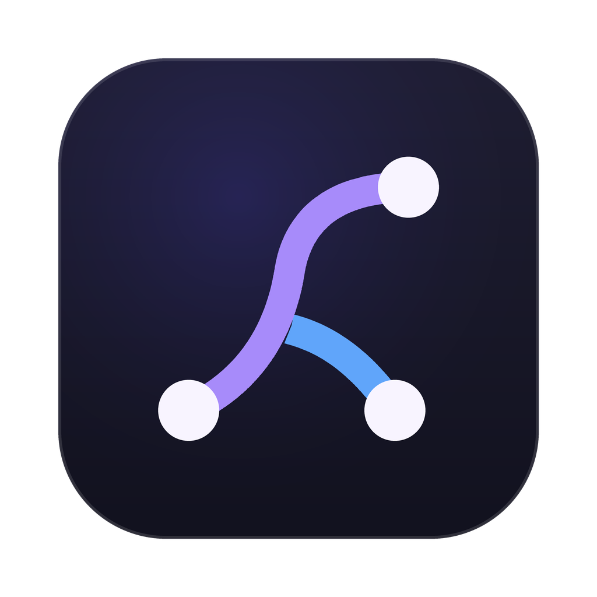

#  Leyline

Leyline is a local web UI for pi coding-agent sessions. It uses Vue 3 and Vite
for the frontend, with Vite middleware that talks to the pi SDK for session
state, prompts, model controls, runtime events, and an embedded terminal.

| Home View | Workbench |
| --- | --- |
| <a href="https://github.com/user-attachments/assets/ae22c31c-9f60-4142-ae58-308ff54309fd" target="_blank" rel="noopener noreferrer"></a> | <a href="https://github.com/user-attachments/assets/ac8dfefe-2ef0-4b0b-8d24-e66dde7484e1" target="_blank" rel="noopener noreferrer"></a> |


## Features

Browse, search, create, and run pi sessions from a local web UI, with rendered
transcripts, live runtime output, model/mode controls, and an embedded terminal.

For the reasoning behind the project, see [Motivations](docs/motivations.md).

## Requirements

- Node.js
- npm
- A configured pi coding-agent environment

## Setup

```sh
npm install
```

## Development

```sh
npm run dev
```

Open the Vite URL shown in the terminal, usually:

```txt
http://localhost:5173/
```

## Optional Electron app

The browser/Vite workflow is the primary development path, but Leyline can also
run as a local Electron desktop app.

For Electron development, start Vite in one terminal:

```sh
npm run dev
```

Then launch Electron in another terminal:

```sh
npm run electron:dev
```

To build a packaged desktop app:

```sh
npm run electron:build
```

The packaged app is written to `release/`. The build first creates the Vite
`dist/` output, then packages Electron with the app icon from `assets/icon` and
unpacks native terminal dependencies needed by `node-pty`.

To install the packaged app locally and expose the `leyline` command:

```sh
npm run local-publish
```

This copies `Leyline.app` to `/Applications/` and symlinks the CLI to
`~/.local/bin/leyline`. Make sure `~/.local/bin` is on your `PATH`, then run:

```sh
cd /path/to/project
leyline
```

The CLI opens or focuses the Electron app and creates a new session for the
current shell directory. Use `leyline -n` to create that session in a new
Leyline window.

## Electron shortcuts

- `cmd+n`: create a new session in the current window
- `cmd+shift+n`: create a new session in a new window
- `cmd+w`: close the current window

## Useful commands

```sh
npm run build
npm run preview
npm run electron:dev
npm run electron:build
npm run local-publish
npm run screenshot
```

`npm run screenshot` expects the dev server to be running and writes the latest
capture to `screenshots/current.png`.
