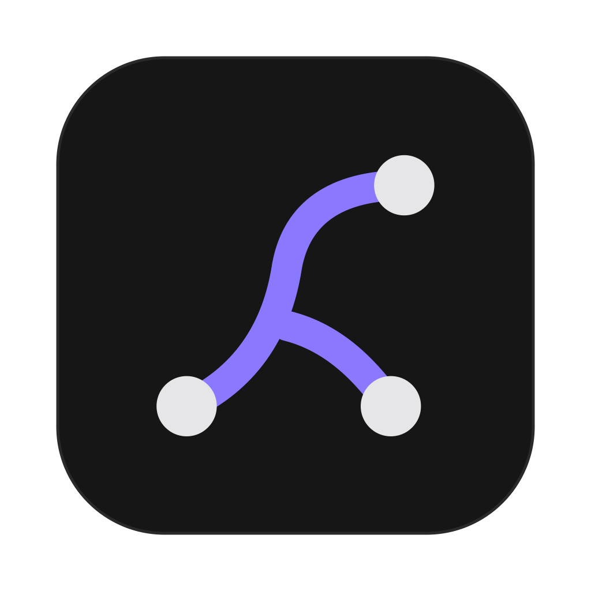
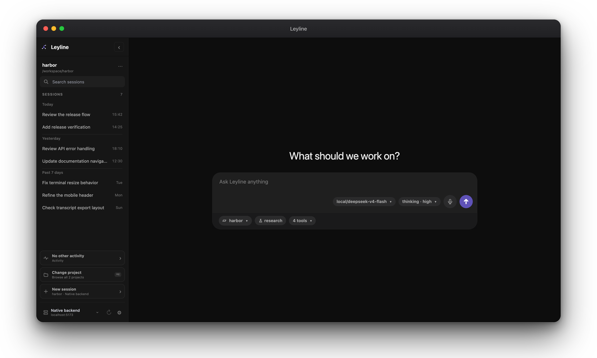
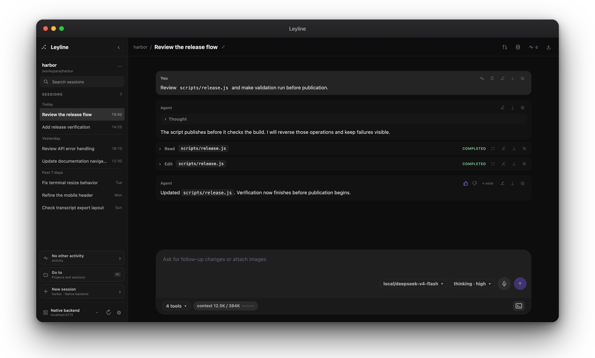

#  Leyline

Leyline is a web UI for pi coding-agent sessions. It uses Vue 3 and Vite for
the frontend. Its native backend uses the pi SDK for sessions, prompts, model
controls, runtime events, and the embedded terminal. You can also save named
connections to other Leyline backends.

## Screenshots

### Start screen

<a href="assets/readme/home.png"></a>

### Workbench

<a href="assets/readme/workbench.png"></a>


## Features

Browse, search, create, and run pi sessions from a focused web UI. Leyline shows
rendered transcripts, live runtime output, Git changes, model controls, memory,
subagents, runtime events, and an embedded terminal. Each window can use the
native backend or a saved backend connection.

On desktop, the Git review pane prepares changed files and the selected diff
before it opens. It separates staged and working-tree changes and can expand
across the workspace.

When the active model cannot receive images, Leyline can send each attachment
to a configured vision model in a hidden child session. The parent model
receives the descriptions while the transcript keeps the original images.

For the reasoning behind the project, see [Motivations](docs/motivations.md).

## Requirements

- macOS
- Node.js 22.19.0, as specified in `.nvmrc`
- npm
- A configured pi coding-agent environment

Leyline is developed and tested on macOS only. Linux and Windows are not
supported. The local Electron publish script currently expects an Apple silicon
build named `Leyline-darwin-arm64`.

## Setup

```sh
npm install
```

## Development

```sh
npm run dev
```

Open the Vite URL shown in the terminal, usually:

```txt
http://localhost:5173/
```

The Vite server also serves the documentation at
`http://localhost:5173/docs/`. To run only the documentation server, use
`npm run docs:dev`.

## Backend connections

The sidebar footer shows the backend for the current window. Open **Settings**
to add, test, edit, remove, or select a named connection. The **Native backend**
is the server that supplied the current Leyline app.

Saved connections and the configured default are app-wide. Each browser or
Electron window keeps its active connection separately. A fresh window uses the
default. A new Electron window inherits the source window's active connection.

Leyline sends runtime HTTP commands, runtime events, terminal WebSocket traffic,
and exports to the active backend. Connection management stays on the native
backend. See [Settings](docs/user-guide/settings.md) for
connection setup and [Environment variables](docs/reference/environment.md) for
packaged server and origin settings.

## Optional Electron app

The browser and Vite workflow is the primary development path. Leyline can also
run as a local Electron desktop app.

For Electron development, start Vite in one terminal:

```sh
npm run dev
```

Then launch Electron in another terminal:

```sh
npm run electron:dev
```

To build a packaged desktop app:

```sh
npm run electron:build
```

The packaged app is written to `release/`. The build creates the Vite `dist/`
output and then packages Electron. It unpacks the native terminal files that
`node-pty` needs.

To install the packaged app locally and expose the `leyline` command:

```sh
npm run local-publish
```

This command copies `Leyline.app` to `/Applications/`. It also links the CLI to
`~/.local/bin/leyline`. Make sure that `~/.local/bin` is on your `PATH`.

```sh
cd /path/to/project
leyline
```

The CLI opens or focuses Leyline and creates a session for the current shell
directory. Use `leyline -n` to create the session in a new Leyline window.

## Electron shortcuts

- `Command+N`: create a session in the current window
- `Command+Shift+N`: create a session in a new window
- `Command+W`: close the current window
- `Command+E`: show or hide the sidebar
- `Command+Shift+E`: open Settings
- `Command+Shift+M`: show or hide Memory
- `Command+Shift+T`: show or hide the terminal
- `Escape`: stop the active run and close open drawers, dialogs, and menus

## Documentation

- [Getting started](docs/getting-started/index.md)
- [Sessions](docs/user-guide/sessions.md)
- [Composer](docs/user-guide/composer.md)
- [Git review](docs/user-guide/git-review.md)
- [Images and vision](docs/user-guide/images-and-previews.md)
- [Memory](docs/user-guide/memory.md)
- [Subagents](docs/user-guide/subagents.md)
- [Goals and events](docs/user-guide/goals-and-events.md)
- [Terminal](docs/user-guide/terminal.md)
- [Electron](docs/electron/index.md)
- [Commands](docs/reference/commands.md)
- [Troubleshooting](docs/reference/troubleshooting.md)

## Useful commands

```sh
npm run build
npm run preview
npm run docs:dev
npm run docs:build
npm run docs:screenshots
npm run electron:dev
npm run electron:build
npm run local-publish
npm run screenshot
npm run video
```

The capture commands require the dev server. `npm run screenshot` writes a
live local capture to `screenshots/current.png`. `npm run docs:screenshots`
refreshes sanitized tracked images with intercepted fixture data.
