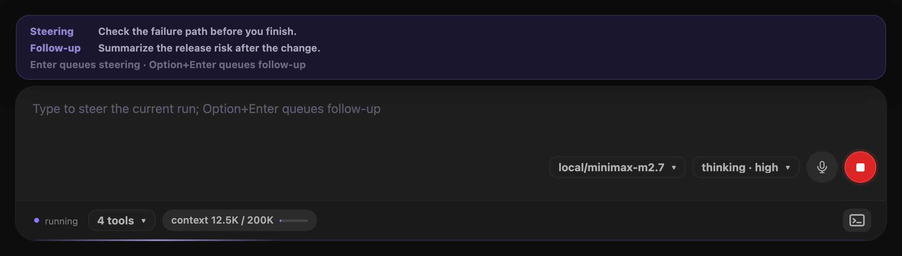
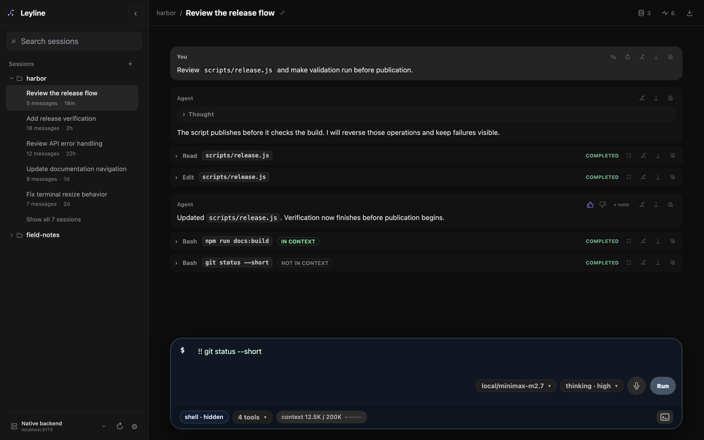

# Composer

Use the composer to send prompts, images, shell commands, slash commands, steering messages, and follow-up messages.

## Send a prompt

1. Enter text in the composer.
2. Press **Enter** or select **Send message**.

Press **Shift+Enter** to add a line break.

The composer remains available during an active run. Model and thinking controls stay disabled until the run ends.

## Steer an active run

Enter a message and press **Enter**. Leyline queues it as **Steering** for the current run.

Steering changes the active run at its next accepted input point. The queued-message drawer shows waiting steering messages.

## Queue a follow-up message



*The queue keeps steering and follow-up messages distinct during an active run.*

Enter a message and press **Option+Enter** during an active run. Leyline queues it as **Follow-up**.

A follow-up starts after the active run finishes. The queued-message drawer shows waiting follow-up messages.

Leyline uses one-at-a-time queues for steering and follow-up messages. The interface does not provide a queue-mode control.

## Stop an active run

Select **Stop generation**. The stop button contains a square while the agent runs.

Pressing **Escape** also sends a stop request. It also closes open menus and drawers.

## Run shell commands



*Shell labels show whether command output enters the session context.*

Start the draft with one of these prefixes:

- `! command` includes command output in session context.
- `!! command` excludes command output from session context.

The composer shows **shell · context** or **shell · hidden**. The saved tool row shows **in context** or **not in context**.

Shell commands cannot include images. Only one shell command can run in a session at a time.

## Compact the context

Enter `/compact` to compact the session. Add text after the command to supply custom instructions.

```text
/compact keep the decisions and unresolved questions
```

Compaction cannot run during an agent response. It cannot include images, and it cannot run while you edit a message.

## Select slash commands and helpers

1. Enter `/` and part of a command name.
2. Use **Arrow Up** or **Arrow Down** to move through results.
3. Press **Tab** or **Enter** to insert the selected item.

Results can be pi commands, prompt helpers, or skills. The source label is **Command**, **Prompt**, or **Skill**.

Press **Escape** to close the picker.

## Paste image attachments

Paste PNG, JPEG, GIF, or WebP images into the composer. Select **×** on an attachment to remove it.

Leyline warns when the selected model does not support images. Remove the images or select a compatible model before submission.

The current composer has no fixed image count or byte limit. Provider and request limits can still reject large attachments.

## Use browser dictation

1. Select **Start dictation**.
2. Speak after the browser starts recognition.
3. Select **Stop dictation** when the draft is complete.

Leyline appends final recognized text to the draft. Browser microphone permission is required.

Dictation is not supported in Electron. It is also unavailable when the browser does not provide the Web Speech API.
