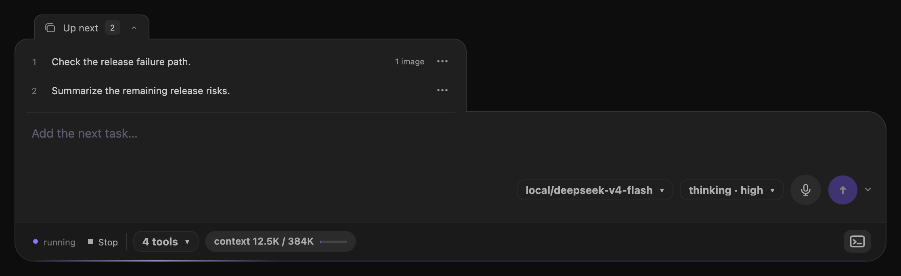
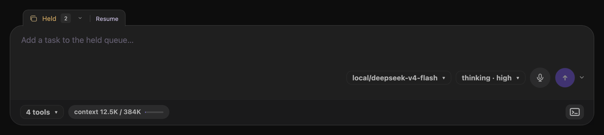
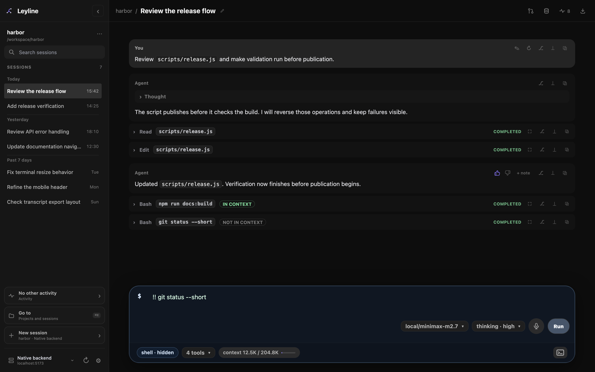

# Composer

Use the composer to send prompts, images, shell commands, slash commands, and steering messages, or add tasks to **Up next**.

## Send a prompt

When the agent is idle and the queue is empty:

1. Enter text in the composer.
2. Press **Enter** or select **Send message**.

Press **Shift+Enter** to add a line break.

The composer remains available during an active run. Model, thinking, and `ultrafast` controls stay disabled until the run ends.

## Queue the next task

During an active run, enter a task and press **Enter** or select the send arrow. Leyline adds the task to **Up next**. You can also select **Send options** beside the arrow, then **Queue next task**.

Leyline sends queued tasks one at a time when the agent becomes idle. You can edit tasks before Leyline sends them.



*The Up next tab opens a tray above the composer input.*

The closed **Up next** tab attaches to the composer's top-left edge and shows the task count. Select the tab to open the tray. The tab moves above the list while the input and footer stay fixed. The tray fills the available width in a narrow composer, including mobile layouts.

With the terminal open, the list scrolls within the remaining space above the composer.

Each task has one actions menu:

- **Edit** changes the task text and holds the queue.
- **Move up** and **Move down** change the task order.
- **Steer now** sends the task to the agent's next accepted input point.
- **Remove** deletes the unsent task.

Actions are unavailable while a task shows **Sending**.

Text edits keep attached images. **Save** and **Cancel** leave the queue held. Select **Resume** after you save or cancel the edit. Closing the tray, switching sessions, or visiting Home keeps an unsaved edit. A browser reload discards these local edits.

The backend keeps pending tasks when you refresh the browser or switch sessions. **Reload runtime** also keeps pending tasks, but holds them until you select **Resume**. Pending tasks do not survive a backend restart.

## Steer an active run

Enter a message and press **Option+Enter**. You can also select **Send options**, then **Steer current run**.

Steering changes the active run at its next accepted input point. If the queue is held, select **Resume** before you steer.

**Sent to agent** separately shows waiting inputs that pi has already accepted, labeled **Steering** or **Follow-up**. You cannot edit, reorder, or remove these inputs from the tray.

**Follow-up** refers only to accepted pi input. Unsent Leyline tasks remain under **Up next**.

## Stop an active run

Select **Stop generation**, shown as **Stop** with a square while the agent runs. Stop interrupts the run and holds the remaining unsent tasks.



*The closed Held tab keeps Resume available without opening the tray.*

Select **Resume** to let Leyline send the remaining tasks. Until then, new tasks also enter the held queue. When the queue becomes empty, the hold clears and the idle composer returns to normal Send. Stop with no pending tasks does not hold future submissions.

The hold applies only to unsent tasks, not inputs under **Sent to agent**.

**Escape** closes an open menu, tray, drawer, dialog, preview, or edit mode first. With no open surface, **Escape** stops the active run.

## Run shell commands



*Shell labels show whether command output enters the session context.*

Start the draft with one of these prefixes:

- `! command` includes command output in session context.
- `!! command` excludes command output from session context.

The composer shows **shell · context** or **shell · hidden**. The saved tool row shows **in context** or **not in context**.

Shell commands cannot include images. Only one shell command can run in a session at a time.

## Compact the context

Enter `/compact` to compact the session. Add text after the command to supply custom instructions.

```text
/compact keep the decisions and unresolved questions
```

Compaction cannot run during an agent response. It cannot include images, and it cannot run while you edit a message.

## Select slash commands and helpers

1. Enter `/` and part of a command name.
2. Use **Arrow Up** or **Arrow Down** to move through results.
3. Press **Tab** or **Enter** to insert the selected item.

Results can be pi commands, prompt helpers, or skills. The source label is **Command**, **Prompt**, or **Skill**.

Press **Escape** to close the picker.

## Paste image attachments

Paste PNG, JPEG, GIF, or WebP images into the composer. Select **×** on an attachment to remove it.

Leyline sends images directly to a model that supports image input. For other models, Leyline saves each image locally. It instructs the model to call `vision_agent` when its turn starts. The tool call and result appear in the transcript.

If no vision model is configured, the warning blocks submission. Open **Settings → Agent defaults** and select a **Vision model**. Use **Project settings** or **Session details** for narrower overrides.

Shell commands and `/compact` cannot include images. Vision delegation does not run for extension slash commands, so do not attach images to those commands.

The current composer has no fixed image count or byte limit. Provider and request limits can still reject large attachments.

See [Images and previews](./images-and-previews) for model scope and context behavior.

## Use browser dictation

1. Select **Start dictation**.
2. Speak after the browser starts recognition.
3. Select **Stop dictation** when the draft is complete.

Leyline appends final recognized text to the draft. Browser microphone permission is required.

Dictation is not supported in Electron. It is also unavailable when the browser does not provide the Web Speech API.
