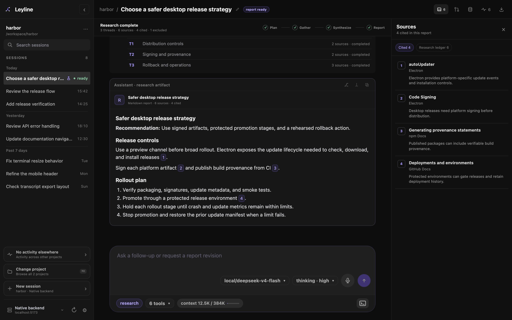
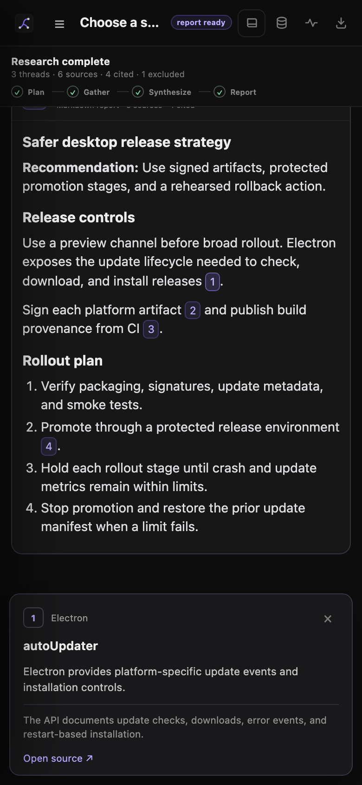

# Deep research

Deep research turns one question into a source-backed report. A lead agent plans the work, runs bounded research threads, and synthesizes their evidence.

*The report stays in the transcript while the source rail shows cited evidence.*

## Start a research session

1. Open the start screen and select a project.
2. Select **research** below the composer.
3. Enter the question that Leyline must investigate.
4. Press **Enter** or select **Send message**.

The heading changes to **What should we investigate?** when research mode is active. The research control appears only when the selected backend supports research sessions.

Leyline creates a new research session and starts the run immediately. The lead records a short plan before it delegates work. It does not wait for plan approval unless you ask it to pause.

The sidebar **New session** action creates a normal session. Shell mode also creates a normal session.

## Follow the research phases

The phase bar shows four steps:

- **Plan**: The lead divides the question into independent threads.
- **Gather**: Research workers collect and assess source evidence.
- **Synthesize**: The lead compares the thread results and builds the citation ledger.
- **Report**: The lead writes the final cited report.

A research plan normally contains two to five threads. The **Research threads** card shows each thread ID, title, source count, and status.

Select a thread row to open its child session. The child transcript contains the worker's tool calls, source work, and final result.

The sidebar marks each research session with a flask. During a run, the row can show its current phase or **gather N/N**. A selected completed session shows **ready**.

## Direct an active run

Enter a message and press **Enter** to steer the lead. The lead receives steering at its next accepted checkpoint.

Press **Option+Enter** to queue a follow-up after the active run. Select **Stop generation** to interrupt the parent run.

A stopped or failed run keeps its persisted plan, threads, and sources. Send another prompt when you want the lead to continue.

## Verify sources and inspect the research ledger

The desktop source pane opens when a research session has sources. Use the source control in the header to close or reopen it.

The pane has two views:

- **Cited** shows sources that the final report cites. This is the default view for a completed report.
- **Research ledger** shows each cited, supporting, and excluded source.

A cited row shows the citation number, title, publisher, publication date when available, and a short claim summary. Select a web source row to open the source. A local source row shows its path.

The research ledger adds the thread, source kind, and status. An excluded row shows its exclusion reason.

Select a numbered report citation to open its source preview. The preview shows the claim, evidence, source details, and external link without hiding the report.

To close the preview, do one of these actions:

- Select outside the preview.
- Scroll the report.
- Resize the window.
- Press **Escape**.

A valid citation uses a numeric Markdown link such as `[3](https://example.com/source)`. The number and target must match a non-excluded ledger source.

Leyline checks citation identity. It does not determine whether the source proves the report's claim.

## Use sources on mobile

*A report citation opens its source preview as a bottom sheet.*

Select a numbered citation to verify its claim and evidence. Select **Open source** to open the web source. Select **×** to close the preview.

Select the source control in the mobile header to open the source pane. The **Cited** and **Research ledger** views use the full screen width.

## Read and revise the report

A valid final response becomes a **research artifact** in the transcript. Its heading shows the report title and source counts.

If a numeric citation is invalid, Leyline marks the research session as interrupted. The response remains in the transcript, but it does not become a completed research artifact.

Use the composer to ask a follow-up question or request a report revision. The lead receives the persisted research state with the next turn.

Research sessions support normal prompt edits, forks, resets, and refreshes. Forks keep branch research state and bind it to the new session. Resets rebuild state from the retained branch.

A backend process restart does not restart interrupted worker calls. Reopen the session and send a prompt to continue.

## Export the research

**Export transcript** writes the report, research-thread cards, and every ledger source to the HTML file. It keeps cited, supporting, and excluded sources.

Exported citations are normal links. The standalone file does not focus a ledger card when you select a citation.
