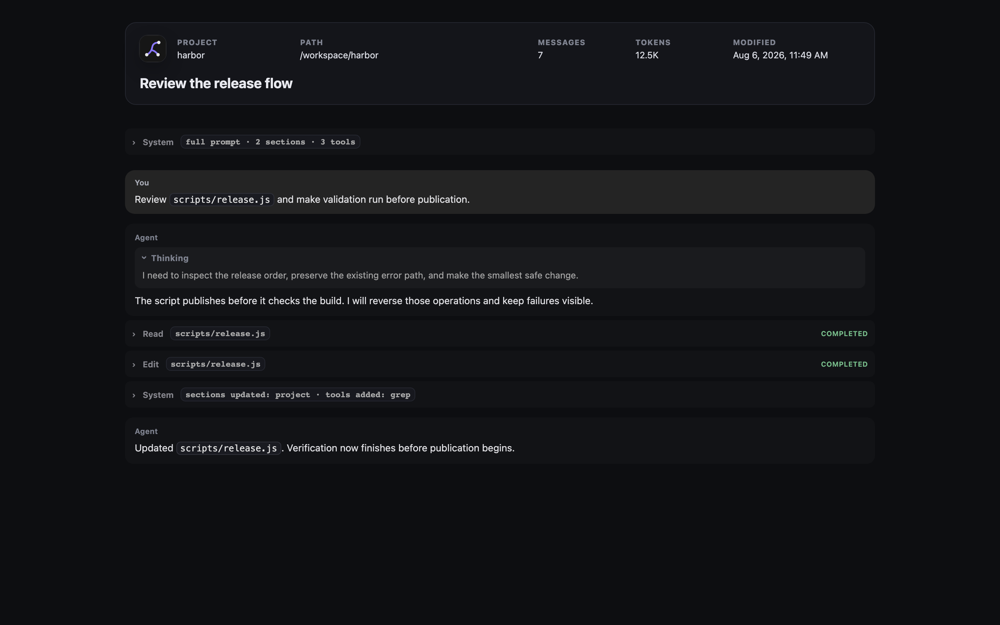

# Export a transcript

Use **Export transcript** to download the selected session as an HTML file.

*The export places session metadata above a standalone transcript view.*

## Download the export

1. Open a non-empty session.
2. Select **Export transcript** in the workbench header.
3. Open the downloaded `.html` file.

The file name starts with `leyline-` and uses the session title when possible.

## Read export metadata

The export header contains:

- Session title.
- Project name.
- Project path.
- Message count.
- Context token count.
- Modified time.

The token value is the latest available context usage. It is not a total of all tokens used across the session.

## Read export content

The export includes rendered Markdown, assistant thoughts, collapsed tool rows, skill rows, subagent results, and attached images.

System events use the same muted dividers as the app. Select **System prompt** or **System updated** to open the prompt inspector.

The **Prompt** tab shows initial prompt sections. Later events use **Changes** for updated or removed sections. These changes do not reconstruct the full prompt. **Tools** shows initial or added tool descriptions and removed tool names.

**Raw text** shows the exact event text. **Copy** copies that same text from either view. **Reading view** returns to the tabs. Select **Close prompt inspector** or press Escape to close the inspector. Exports do not include **Fork from here** or **Reset to here**.

The inspector controls use embedded JavaScript, independent of the external Pierre preview renderer. They do not require network access.

A deep research export also includes the styled report, research-thread results, and every ledger source. Each source shows one evidence summary. An excluded source shows its exclusion reason instead.

Tool rows render their previews when you expand them. Exported runtime event rows are omitted.

Images and transcript data are embedded in the HTML. File, diff, and patch previews load their renderer from `esm.sh` when expanded. Those previews require network access.

## Use the responsive layout

The export changes to a compact layout below 820 pixels. Metadata uses two columns, and message padding decreases.

Above 1120 pixels, the System inspector reserves space beside the transcript. At narrower widths, it overlays the right side. At 760 pixels or less, it fills the viewport width.

The HTML also respects the system reduced-motion preference.

Research citations remain normal links in the standalone file. They do not focus a source-ledger card.

## Share an inline export

A server can open the export inline by using the inline disposition URL. When public sharing is configured, Leyline adds canonical, Open Graph, and Twitter metadata.

The share metadata contains the title, project name, message count, page URL, and a configured preview image. The normal header action downloads the file.
