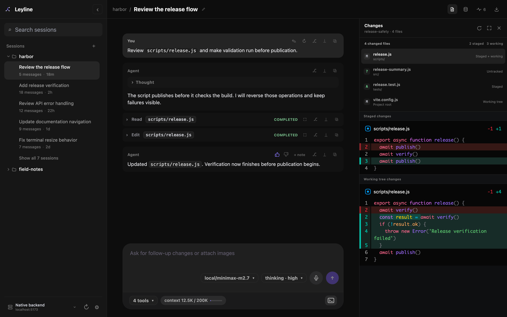
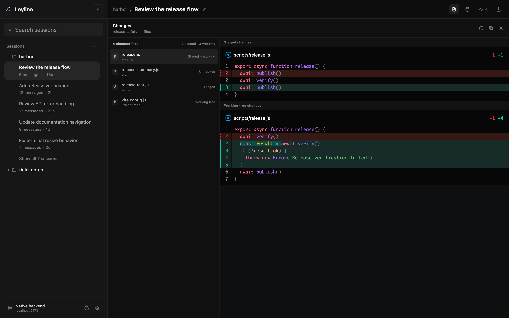

# Review Git changes

The desktop review pane shows uncommitted Git changes for the selected session's project. It is read-only and uses the selected backend's filesystem.

*The review rail keeps the transcript visible while you inspect project changes.*

## Open the review pane

1. Open a session in a Git project.
2. Select **Review changes** in the session header.
3. Select a changed file to inspect its diff.

The control appears when the viewport is wider than 1120 pixels and the selected backend supports Git review.

Leyline prepares the file list and first diff before it opens the pane. The header shows the current branch and changed-file count.

## Read file states

Each file row shows its Git state and change scope. The list can include these states:

- **Staged** changes are in the Git index.
- **Working tree** changes are not staged.
- **Untracked** files are new files that Git does not track.
- **Conflict** files need conflict resolution.

A file can have staged and working-tree changes at the same time. Leyline keeps those diffs in separate sections.

Renamed files show the old and new paths. Binary files show a binary-file state instead of a text diff.

## Resize or expand review

Drag the left edge of the pane to change its width. You can also focus the resize handle and use **Arrow Left** or **Arrow Right**.

Select **Expand review** to use the full workspace after the sidebar. The file list becomes a narrow column beside the diff.

*Expanded review hides the transcript until you collapse or close the review pane.*

Press **Escape** or select **Collapse review** to restore the transcript and the previous pane width.

## Refresh changes

Leyline refreshes review after a known agent run or composer shell command settles. Select **Refresh changes** after another application changes the working tree.

## Use the terminal for Git actions

Review does not stage, discard, or commit changes. Use the terminal for Git actions and for these cases:

- The project has more than 500 changed files.
- A text diff is larger than 1 MiB or 5,000 lines.
- The changed path is a nested Git repository.
