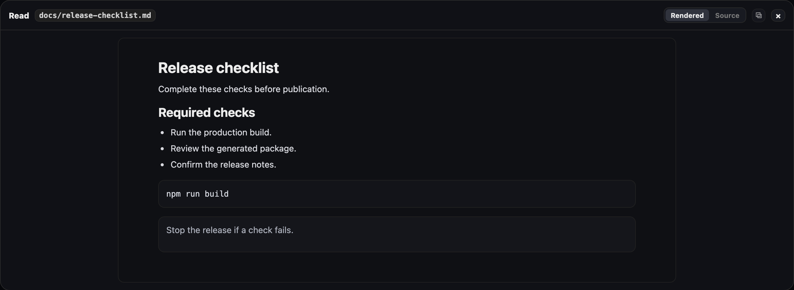

# Images and previews

Leyline supports pasted prompt images, vision delegation, and transcript previews for tool output.

## Attach an image to a prompt

1. Copy one or more images.
2. Paste them into the composer.
3. Select **×** to remove an unwanted image.
4. Send the prompt.

Leyline accepts PNG, JPEG, GIF, and WebP image data. The composer has no fixed image count or byte limit. Provider and request limits still apply.

Leyline sends the images directly when the selected model supports image input. When it does not, Leyline can use a configured vision model to describe each image first. The composer shows the vision model before submission.

If no vision model is configured, the composer blocks submission and shows a warning. Configure a vision model or select a model that supports image input.

Shell commands and `/compact` cannot include images. Vision delegation does not run for extension slash commands. Do not attach images to those commands.

## Configure vision delegation

1. Open **Settings**.
2. Find **Agents**.
3. Select **Manage** beside **Vision agent**.
4. Select **Transcript**, **Project**, or **Global**.
5. Select a model that supports image input.

Leyline chooses the first configured model in this order:

1. The **Transcript** override.
2. The **Project** override.
3. The **Global** default.

The start screen has no transcript yet, so the drawer selects **Project**. A session fork copies its **Transcript** override.

Select **Inherit from lower scope** to remove a transcript or project override. Select **None configured** to remove the global default.

## Understand delegated image context

For each image, Leyline starts a hidden child session with the configured vision model. The child describes the image and answers image-related parts of the prompt.

The parent model receives the description instead of the image. The saved user message keeps the original prompt and images, including after a reload or branch change.

The configured model provider receives the image and prompt. The hidden child session also keeps its prompt and image in local pi session history. Hidden child sessions do not appear in the sidebar, but Leyline does not delete their JSONL files.

Use a provider and local storage policy that are appropriate for the image data.

Agents can also use the `vision_agent` tool to inspect an image file from the project. See [Vision agent integration](../integrations/vision-agent).

## Read prompt images

Images sent with a user message appear below that message. Each image uses its data from the session content.

## Expand a tool preview

Select a collapsed tool row. Leyline can show these preview types:

- Image output from an image read.
- File content from a file read.
- A before-and-after diff.
- A patch.
- Plain text or formatted JSON when no structured preview is available.

An inline file preview shows up to 400 lines. It reports the number of clipped lines when more content exists.

## Open a fullscreen preview

*Fullscreen mode uses the complete projected preview data.*

1. Select the fullscreen action in the tool header.
2. Inspect the full available preview.
3. Select **×** or the backdrop to close it.

The fullscreen view uses the available file, image, patch, diff, JSON, or plain-text data. Select **Copy** to copy the available tool output.
