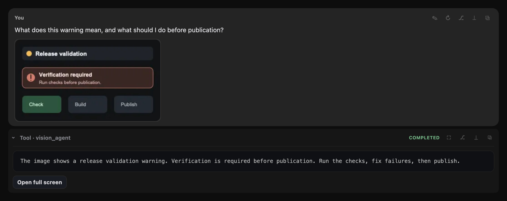
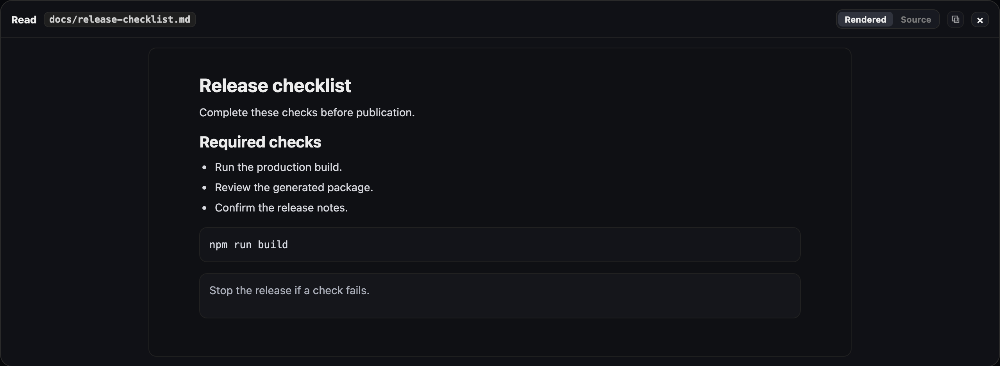

# Images and previews

Leyline supports pasted prompt images, vision delegation, tool-output previews, and local file links.

## Attach an image to a prompt

1. Copy one or more images.
2. Paste them into the composer.
3. Select **×** to remove an unwanted image.
4. Send the prompt.

Leyline accepts PNG, JPEG, GIF, and WebP image data. The composer has no fixed image count or byte limit. Provider and request limits still apply.

Leyline sends images directly when the selected model supports image input. When it does not, Leyline saves each image locally. It instructs the parent model to call `vision_agent`. The tool call and result appear in the transcript. The composer identifies the selected vision model before submission.

If no vision model is configured, the composer blocks submission and shows a warning. Configure a vision model or select a model that supports image input.

Shell commands and `/compact` cannot include images. Vision delegation does not run for extension slash commands. Do not attach images to those commands.

## Configure vision delegation

1. Open **Settings**.
2. Find **Agents**.
3. Select **Manage** beside **Vision agent**.
4. Select **Transcript**, **Project**, or **Global**.
5. Select a model that supports image input.

Leyline chooses the first configured model in this order:

1. The **Transcript** override.
2. The **Project** override.
3. The **Global** default.

The start screen has no transcript yet, so the drawer selects **Project**. A session fork copies its **Transcript** override.

Select **Inherit from lower scope** to remove a transcript or project override. Select **None configured** to remove the global default.

## Understand delegated image context

For each image that requires delegation, Leyline saves a local attachment. When the parent turn starts, the model calls `vision_agent`. The tool starts a hidden child session with the configured vision model. The child returns a detailed text description.

*The parent model calls `vision_agent`, and its result appears as a normal transcript tool row.*

The parent model receives the tool result instead of the image. The saved user message keeps the original prompt and images, including after a reload or branch change.

Leyline removes the session attachment directory when it moves a session or project to trash.

The configured model provider receives the image and prompt. The hidden child session also keeps its prompt and image in local pi session history. Hidden child sessions do not appear in the sidebar, but Leyline does not delete their JSONL files.

Use a provider and local storage policy that are appropriate for the image data.

Agents can also use the `vision_agent` tool to inspect an image file from the project. See [Vision agent integration](../integrations/vision-agent).

## Read prompt images

Images sent with a user message appear below that message. Each image uses its data from the session content.

## Preview a local file

Select a local file link in the transcript to open **File preview**. Leyline reads the current file on the session's backend. This preview can differ from an earlier tool result.

Relative paths use the session project directory. Links inside a rendered file preview use that file's directory. Line references open the source view at the requested line. Markdown without a line reference opens in **Rendered** mode. Select **Source** to inspect its text.

Right-click a local file link, or select **Actions** in the preview, for file actions:

- **Preview file** opens the current file.
- **Open in editor** uses the backend's configured editor.
- **Configure editor…** opens Settings when no editor is available.
- **Reveal in Finder** or **Open containing folder** appears when the backend supports desktop file actions.
- **Copy path** copies the resolved path.

A file outside the project requires approval before Leyline previews or opens it. Review the path, then select **Preview file** or **Open file** to approve that action. Approval applies to this file only.

Use **Back** to return to a previous file preview. Select **×**, the backdrop, or press **Escape** to close it.

Text previews support UTF-8 files up to 2 MiB and 20,000 lines. Supported raster image previews allow up to 10 MiB. Binary files cannot use the text preview. See [Files settings](./settings#configure-file-actions) for editor commands and execution mode.

## Expand a tool preview

Select a collapsed tool row. Leyline can show these preview types:

- Image output from an image read.
- File content from a file read.
- A before-and-after diff.
- A patch.
- Plain text or formatted JSON when no structured preview is available.

An inline file preview shows up to 400 lines. It reports the number of clipped lines when more content exists.

## Open a fullscreen preview

*Markdown read results open in **Rendered** mode. Select **Source** to inspect the original file.*

1. Select the fullscreen action in the tool header.
2. For a Markdown read, select **Rendered** or **Source**.
3. Select **×** or the backdrop to close the preview.

The **Copy** action always copies the original Markdown source. Raw HTML stays disabled in the rendered view. Remote images appear as references. Local file links open current-file previews on supported backends.

Other fullscreen previews use the available file, image, patch, diff, JSON, or plain-text data. Select **Copy** to copy the available tool output.
