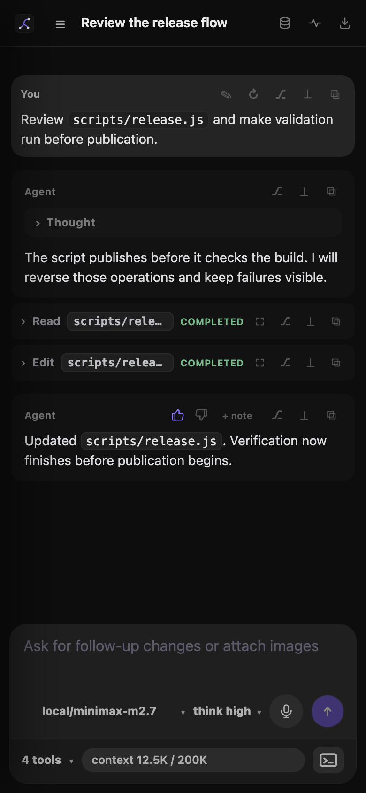
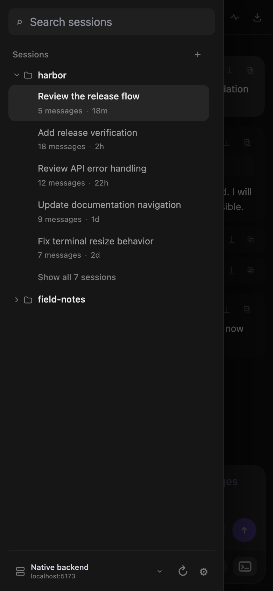

# Mobile layout

Leyline uses a mobile layout when the viewport is 760 pixels wide or less.

*The mobile workbench keeps the main session actions in one column.*

## Use the mobile header

The header shows the Leyline mark, **Open sessions**, the session title, and available transcript controls.

The project part of the breadcrumb is hidden. The session rename glyph is also hidden, but you can select the title to rename it.

The **Memory**, **Events**, and **Export transcript** icons remain available. Their numeric counts are hidden.

## Open the mobile sidebar

*The session navigator opens above the mobile workbench.*

1. Select **Open sessions** in the header.
2. Select a project or session.

The sidebar opens over the workbench. Select the shaded area or a session to close it.

The sidebar can use up to 86 percent of the viewport width, with a maximum width of 320 pixels.

## Use transcript actions

Message and tool actions remain in their row headers. Use them to copy, edit, retry, fork, reset, or open tool output.

Tool targets can shorten to fit the row. User messages and tool cards use the full transcript width.

## Use the mobile composer

The composer stays above the bottom edge. Model, thinking, dictation, and send controls use one row.

The context row contains runtime status, shell mode, tool count, context text, and the terminal control. Some secondary status chips are hidden to keep the row compact.

The model control uses the `provider/model-id` label. The thinking control uses a shortened label. The context progress bar is hidden, but its token text remains.

## Use drawers and the terminal

Right-side drawers can use the full viewport width, with a maximum width of 420 pixels.

The terminal opens from the bottom. Its default mobile height is the smaller of 46 percent of the viewport or 310 pixels.

The transcript adds space for the composer and terminal, so the newest output remains reachable.
