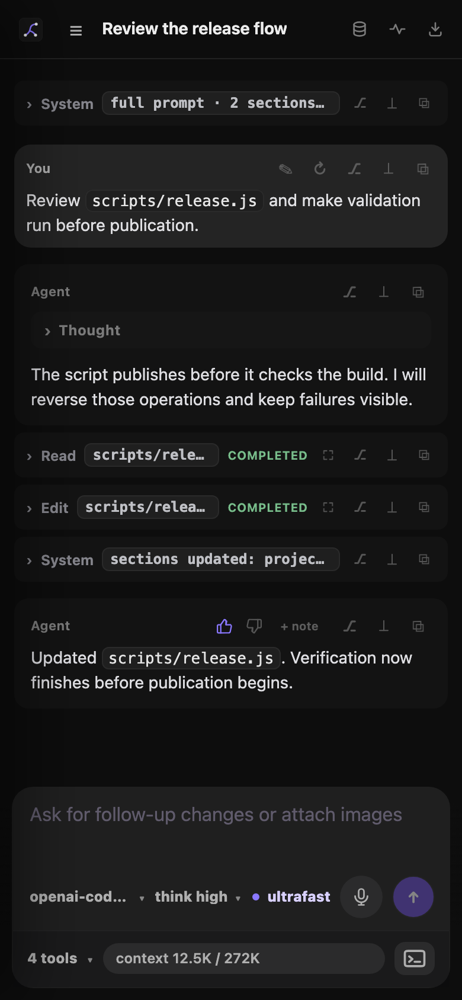
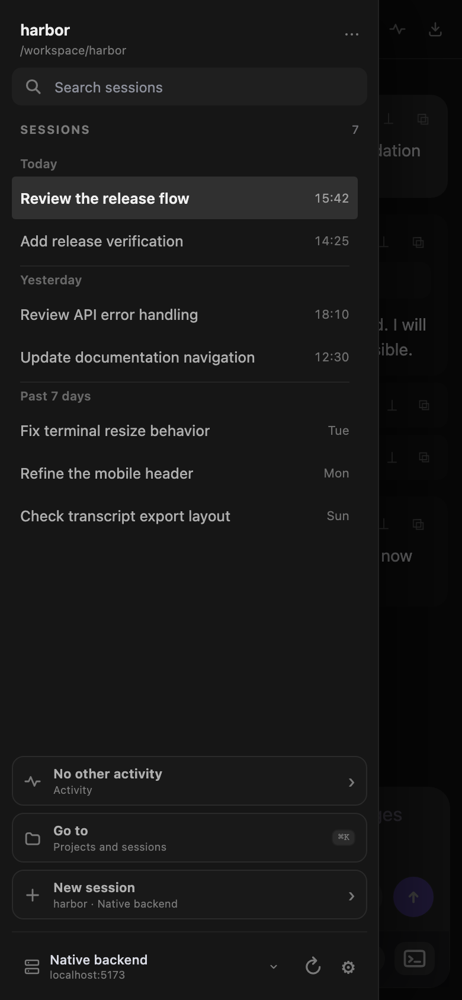
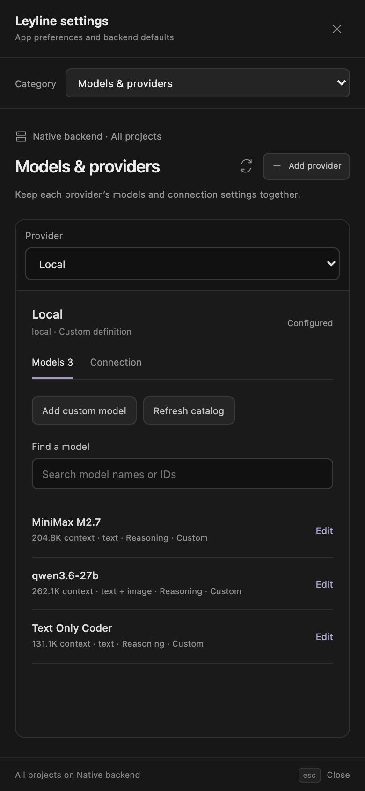
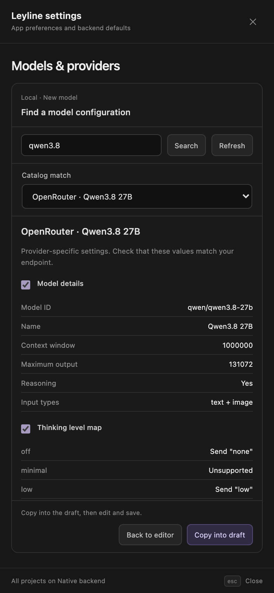
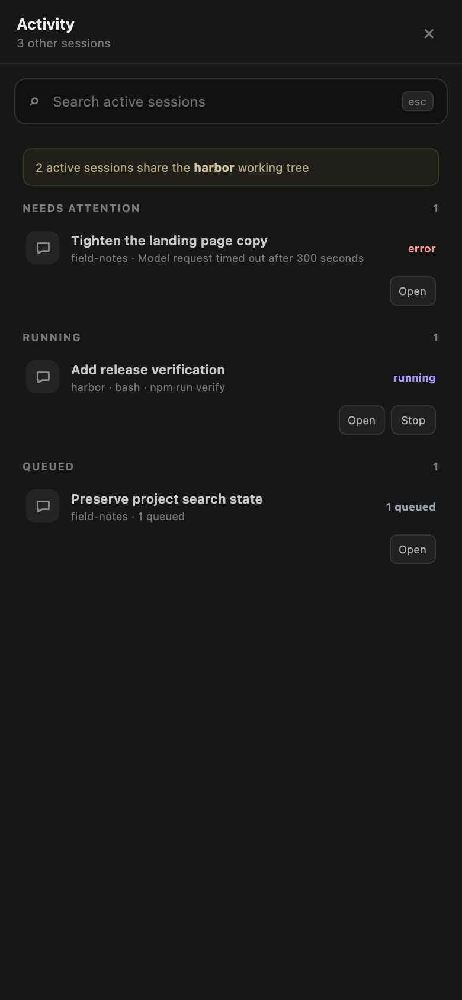

# Mobile layout

Leyline uses a mobile layout when the viewport is 760 pixels wide or less.

*The mobile workbench keeps the main session actions in one column.*

## Use the mobile header

The header shows the Leyline mark, **Open sessions**, the session title, and available transcript controls.

The project part of the breadcrumb is hidden. The session rename glyph is also hidden, but you can select the title to rename it.

The **Session details**, **Memory**, **Events**, and **Export transcript** icons remain available. Numeric counts are hidden.

A research session also shows its compact state and source control. The source count is hidden, but the control remains available.

## Open the mobile sidebar

*The session navigator opens above the mobile workbench.*

1. Select **Open sessions** in the header.
2. Select a session in the current project.

Select **Go to** to open a session from another project.

The sidebar opens over the workbench. Select the shaded area or a session to close it.

The sidebar can use up to 86 percent of the viewport width, with a maximum width of 320 pixels. **Activity**, **Go to**, and **Add project** use the full viewport. **Add project** keeps its confirmation actions at the bottom.

## Open Settings on mobile

1. Select **Open sessions**.
2. Select **Open settings** at the bottom of the sidebar.
3. Use **Category** to select the settings page.

Settings fills the mobile viewport. **Models & providers** and **MCP servers** use a **Provider** or **Server** selector instead of the desktop list. Detail content scrolls within the modal.

Use **Close Leyline settings** to return to the workspace. See [Settings](./settings) for scope, authentication, and reload behavior.

### Edit a model or copy catalog fields

The model editor temporarily hides the category and provider selectors. **Model**, **Thinking & compatibility**, and **Pricing** share one draft. Save/Test stay visible below the fields.

**Find in catalog** replaces the fields with search and review. Use **Catalog match** to choose a provider variant. Search and the Back/Copy controls stay visible while the review scrolls.

Copying **Model details** opens **Model**, where you can edit a new model's imported ID. **Back to editor** keeps your draft. See [Catalog lookup](./settings#find-a-configuration-in-the-catalog) for copied fields and exclusions.

## Supervise activity on mobile

*Activity keeps long session details bounded and moves row controls below the status on narrow screens.*

1. Select **Open sessions**.
2. Select **Activity**.
3. Select **Open** or **Stop** for a session.

The mobile view uses the same attention, running, queued, held, and shared-working-tree states as the desktop view. Open a session to resume its held queue or reply to a confirmation.

## Use transcript actions

Message and tool actions remain in their row headers. Use them to copy, edit, retry, fork, reset, or open tool output.

Tool targets can shorten to fit the row. User messages and tool cards use the full transcript width.

## Use the mobile composer

The composer stays above the bottom edge. Model, thinking, optional `ultrafast`, dictation, and send controls share the primary row. With `ultrafast` available, narrow screens move the model control to its own row.

The `ultrafast` chip uses the same supported models, premium pricing, and session scope as on desktop. See [Runtime controls](./runtime-controls#use-ultrafast).

During an active run, the send arrow adds the draft to **Up next**. Select **Send options** beside the arrow for **Queue next task** or **Steer current run**.

Select the attached **Up next** tab to open the tray across the composer width. The tab moves above the list. The input and footer stay fixed while the list scrolls. Each task has one actions menu for edits, order changes, steering, and removal.

**Stop** holds remaining unsent tasks. The closed **Held** tab shows the count and **Resume**. Text edits keep images, and closing the tray keeps an unsaved edit. Save or cancel the edit before you select **Resume**. See [Composer](./composer#queue-the-next-task) for queue details.

The context row contains runtime status, shell mode, tool count, context text, and the terminal control. Some secondary status chips are hidden to keep the row compact.

The model control uses the `provider/model-id` label. The thinking control uses a shortened label. The context progress bar is hidden, but its token text remains.

## Open research sources

A [deep research](./deep-research) source pane opens across the full viewport. It has **Cited** and **Research ledger** views.

Select the source control in the header to open the pane. Select **×** to close the pane and return to the report.

Select a report citation to open its source preview as a bottom sheet.

## Use drawers and the terminal

Right-side drawers can use the full viewport width, with a maximum width of 420 pixels.

The terminal opens from the bottom. Its default height is 310 pixels.

The transcript adds space for the composer and terminal, so the newest output remains reachable.
