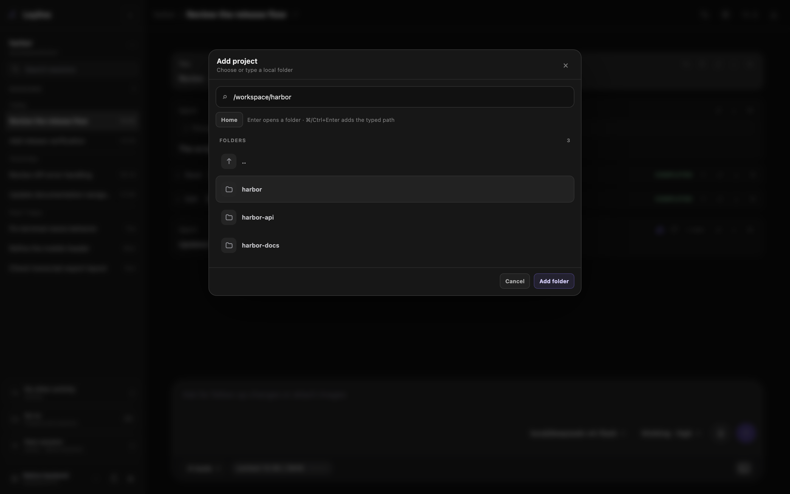

# Projects and search

Leyline uses each session CWD as a project. The project name is the final folder name.

The sidebar keeps one current project in focus. It shows the project path, session search, session list, and project shortcuts.

## Find a session in the current project

1. Enter text in **Search sessions**.
2. Select a matching session.

Search matches session names and IDs in the current project. Each search term must match one of those values.

Search does not inspect transcript content. Clear the field to restore the full session list.

## Use Go to

*Go to searches projects and sessions from one place.*

1. Select **Go to**, or press **Command+K** or **Ctrl+K**.
2. Enter text in **Search sessions or projects** if necessary.
3. Select a project or session.

The default view shows recent projects and current or recent sessions. A query searches all project names, CWDs, session names, and session IDs.

When you select a project, Leyline opens the last session that you used in that project. Otherwise, it opens the most recent session.

If the project has no sessions, Leyline opens the start screen for that CWD.
Command-click, Ctrl-click, or middle-click a project or session result to open
that same target in a new tab or window.

Select **Add project** in the navigator header to add a project folder.

Leyline ignores the shortcut during deletion confirmation, transcript editing, or session renaming.

Press **Escape** or select the shaded area to close the navigator.

## Supervise session activity

*Activity keeps live session state and controls in one compact view.*

Select **Activity** at the bottom of the sidebar.

The navigator excludes the selected session. It includes activity from every project, including other sessions in the current project:

- **Needs attention** contains unread sessions and errors.
- **Running** contains running and compacting sessions.
- **Queued** contains sessions with queued messages.

A row shows the project and the current tool target, exact runtime error, or queue state when available.

Select **Open** to open the session. Use a modified click on **Open** to open it
in a new tab or window. Select **Stop** to interrupt a streaming agent run
without opening it.

Compaction does not show **Stop** because the interrupt action cannot cancel compaction.

Activity warns when multiple active or queued sessions share one CWD. The warning identifies collision risk. It does not attribute working-tree changes to a session.

Use **Search active sessions** to match a session title, project, CWD, tool target, or error detail.

## Open Project details

*Project Details provides focused session management for the current project.*

1. Select **Project actions** beside the current project.
2. Select **Project details**.

The drawer shows the CWD, session count, and current-session relationship.

The **Project actions** menu also contains **Trash project**. This action moves all project sessions to Leyline trash after confirmation.

## Filter and sort project sessions

Enter a name or session ID in **Filter sessions**. This filter uses text containment.

Select **Recent** to sort by time. Select **Title** to sort by session title.

## Manage a project session

Each session card provides these actions:

- **Open** selects the session.
- **Rename** changes its displayed name.
- **Delete** opens the session deletion confirmation.

The selected session shows **Selected** instead of **Open**. Use a modified
click on either control to open that session in a new tab or window.

Select **New session** to create an empty session in the project CWD. Use a
modified click to create one empty session in a new tab or window.

**Delete** moves the session JSONL file to Leyline trash. Confirm this effect in the **Delete session?** dialog.

## Add a project folder

*Add project accepts a path and lets you browse matching local folders.*

Select **Go to**, then select **Add project** in the navigator header. You can also select **Add new project** on the start screen.

The **Add project** browser can open an existing folder or create the typed folder. See [Start screen](./start-screen#add-a-project-folder) for its keyboard controls.

Adding a folder creates a session in that folder. Leyline does not keep a separate project registry.
