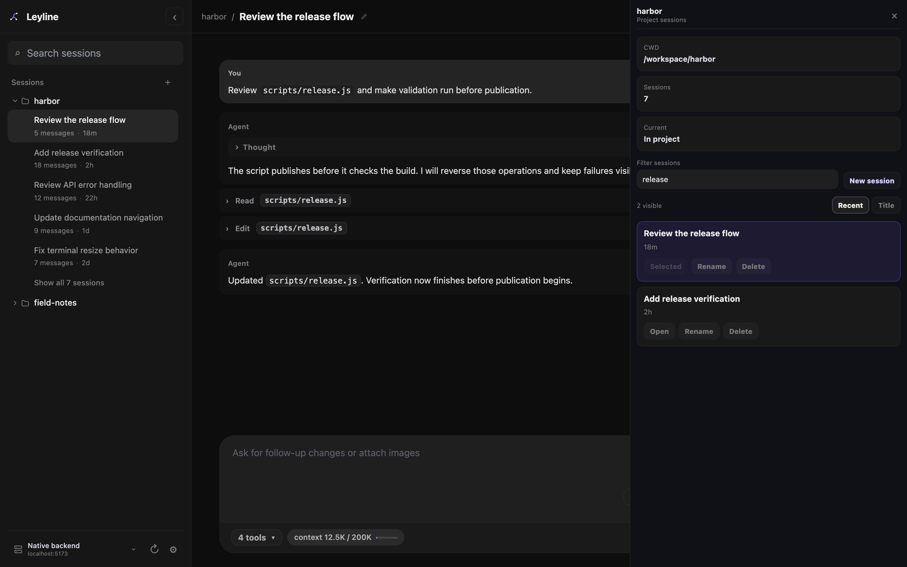

# Projects and search

Leyline groups regular sessions by project CWD. The project name is the final folder name.

## Search the sidebar

1. Enter text in **Search sessions**.
2. Select a matching project or session.

Search uses fuzzy matching against visible project and session labels. It does not search transcript content.

All search terms must match one label. Leyline highlights matched characters in each result.

## Expand a project

Select a project name to expand or collapse it. The expanded group shows the five-session preview unless search is active.

Select **Show all N sessions** to show all sessions. Select **Show fewer** to restore the preview.

## Open Project details

*Project Details provides focused session management for one project.*

1. Point to a project row.
2. Select **Project details**.

The **Project details** drawer shows the CWD, session count, and current-session relationship.

## Filter and sort project sessions

Enter a name or session ID in **Filter sessions**. This filter uses text containment, not fuzzy matching.

Select **Recent** to sort by time. Select **Title** to sort by session title.

## Manage a project session

Each session card provides these actions:

- **Open** selects the session.
- **Rename** changes its displayed name.
- **Delete** opens the session deletion confirmation.

The selected session shows **Selected** instead of **Open**.

Select **New session** to create an empty session in the project CWD.

**Delete** moves the session JSONL file to Leyline trash. Confirm this effect in the **Delete session?** dialog.

## Add a project folder

Select the **New session** plus control in the **Sessions** header. You can also select **Add new project** on the start screen.

The **Add project folder** browser can open an existing folder or create the typed folder. See [Start screen](./start-screen#add-a-project-folder) for its keyboard controls.

Adding a folder creates a session in that folder. Leyline does not keep a separate project registry.
