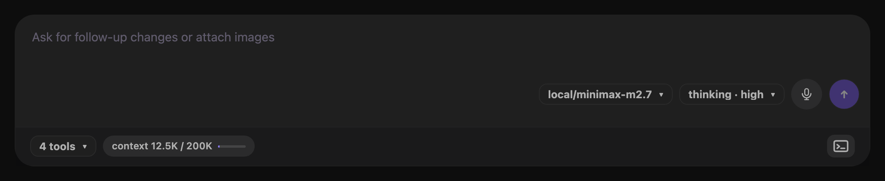

# Runtime controls

The composer shows controls for the model, thinking level, tools, and context usage.

*Runtime controls stay with the composer for the selected session.*

## Select a model

1. Select the model control.
2. Enter text in **Filter models**.
3. Select a model from the results.

The control and result rows use `provider/model-id` labels. Filtering also matches the model display name, provider, and model ID.

You cannot change the model during a run, compaction, submission, or runtime reload.

## Select a thinking level

1. Select the **thinking** control.
2. Select an available level.

A model without reasoning support offers **off** only. Reasoning models can offer **minimal**, **low**, **medium**, **high**, **xhigh**, or **max**.

The **xhigh** and **max** levels appear only when the selected model supports them. Changing the model updates this list.

## Inspect enabled tools

Select the tool-count control, such as **12 tools**. The **Enabled tools** list shows each active tool name.

The control can show **0 tools**. The list is read-only.

## Read context usage

The context indicator shows used tokens and the model context limit. Its bar changes to a warning state at 80 percent and a danger state at 95 percent.

Point to the indicator to see the percentage. Before a response reports usage, the indicator states that usage is unknown.

The context control is an indicator. It does not open a popover.

## Stage controls for a new session

The start screen loads runtime choices for the selected project. Model and thinking changes remain staged until you create the session.

Leyline applies the staged model first. It then applies the staged thinking level and submits the first prompt.
