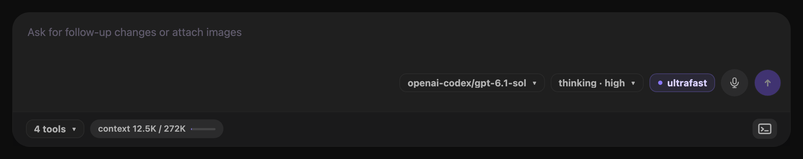

# Runtime controls

The composer shows controls for the model, thinking level, optional `ultrafast`, tools, and context usage.

*Runtime controls stay with the composer for the selected session.*

## Select a model

1. Select the model control.
2. Enter text in **Filter models**.
3. Select a model from the results.

The control and result rows use `provider/model-id` labels. Filtering also matches the model display name, provider, and model ID.

You cannot change the model during a run, compaction, submission, or runtime reload. Leyline records the selected model in the session and saves it as the pi default for new sessions.

## Select a thinking level

1. Select the **thinking** control.
2. Select an available level.

A model without reasoning support offers **off** only. Reasoning models can offer **minimal**, **low**, **medium**, **high**, **xhigh**, or **max**.

The **xhigh** and **max** levels appear only when the selected model supports them. Changing the model updates this list. Leyline records the thinking level in the session and saves the selection as the pi default.

## Use ultrafast

The lowercase `ultrafast` chip appears beside the model and thinking controls for supported models and authentication:

- `gpt-6-astra` or `gpt-6.1-sol` on `openai-codex` Responses.
- The same models on direct `openai` Responses with API-key authentication.

Direct `openai` subscription authentication does not support this control. Local models do not support it.

`ultrafast` requests the premium service tier. It is off by default and uses premium pricing. The thinking level stays the same.

Click the chip while the runtime is idle to enable or disable it. The change is direct, with no confirmation dialog.

The choice applies only to the current runtime/session. It resets on model changes, runtime reload, tree navigation, and fork. Normal agent turns use the selected mode. Compaction and branch summaries remain Standard.

On Home, the choice stays staged until Leyline creates the session. Leyline applies it after the staged model and thinking level, before the first prompt.

## Inspect enabled tools

Select the tool-count control, such as **12 tools**. The **Enabled tools** list shows each active tool name.

The control can show **0 tools**. The list is read-only.

## Read context usage

The context indicator shows used tokens and the model context limit. Its bar changes to a warning state at 80 percent and a danger state at 95 percent.

Point to the indicator to see the percentage. Before a response reports usage, the indicator states that usage is unknown.

The context control is an indicator. It does not open a popover.

## Stage controls for a new session

The start screen loads runtime choices for the selected project. Model, thinking, and `ultrafast` choices remain staged until you create the session.

Leyline applies the staged model first, then the thinking level and `ultrafast` choice, before the first prompt.
