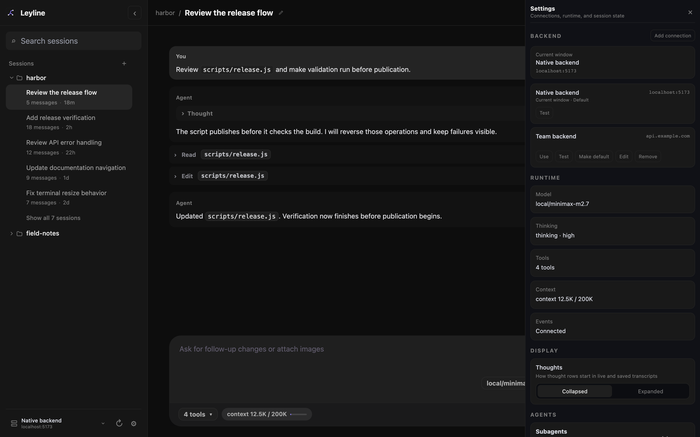

# Settings

The **Settings** drawer manages backend connections, transcript display, and subagent defaults. It also shows runtime and session information.

## Open Settings

Select **Open settings** at the bottom of the sidebar. In Electron on macOS,
press **Command+Shift+E**.

## Manage backend connections

The **Backend** section lists the native backend and each saved connection. The
native backend is the server that supplied the current Leyline app. You cannot
edit or remove it.

To add a connection:

1. Select **Add connection**.
2. Enter a name.
3. Enter the backend URL.
4. Select **Test**.
5. Select **Save**.

The URL must use `http` or `https`. It can contain a hostname, an IP address, a
port, and a base path. Do not add `/api/pi`; Leyline adds that path.

Each connection has these actions:

- **Use**: Select the backend for the current window.
- **Test**: Check the server identity and API version.
- **Make default**: Select the backend for fresh windows.
- **Edit**: Change the name or URL of a saved connection.
- **Remove**: Delete a connection that is not active in the current window.

Saved connections and the default are app-wide. Each window keeps its active
backend separately. New Electron windows inherit the active backend from the
source window.

When you select another backend, Leyline reloads the current window. An active
agent run continues on the previous backend. Leyline clears an unsent composer
draft after confirmation.

::: warning
The Leyline backend API does not have authentication. Do not expose the server
to an untrusted network.
:::

For remote browser access, configure the server to allow the frontend origin.
See [Environment variables](../reference/environment).

## Inspect runtime state

The **Runtime** section shows:

- **Model**: the selected provider and model ID.
- **Thinking**: the selected thinking level.
- **Tools**: the enabled tool count.
- **Context**: used context tokens and the context limit.
- **Events**: **Connected**, **Connecting**, or **Error**.

These values are read-only in **Settings**. Change the model and thinking level in the composer.

## Set the thought display default

1. Find **Display**.
2. For **Thoughts**, select **Collapsed** or **Expanded**.

The setting controls the initial state of each new **Thought** or **Thinking** row. If no setting is saved, Leyline uses **Collapsed**.

The setting does not change a row that is already in the transcript. The **Thinking** value in **Runtime** shows the model thinking level.

## Manage subagent models

1. Find **Agents**.
2. Select **Manage** beside **Subagents**.

The **Subagents** drawer manages model defaults by transcript, project, and global scope. See [Subagents](./subagents).

## Inspect session state

The **Session** section shows:

- **Project**.
- **Session ID**.
- **CWD**.
- **Path**.
- **Messages**.

Select **Copy session ID**, **Copy CWD**, or **Copy path** to copy the related value.

## Reload the runtime

**Reload runtime** is at the bottom of the sidebar, beside **Open settings**. It is not inside the **Settings** drawer.

Select **Reload runtime** to reload keybindings, extensions, skills, prompts, and themes for the selected runtime.

Reload is disabled when no session is selected or while the selected agent runs.
