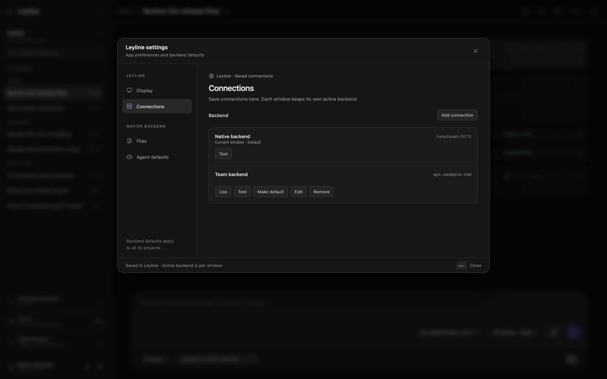
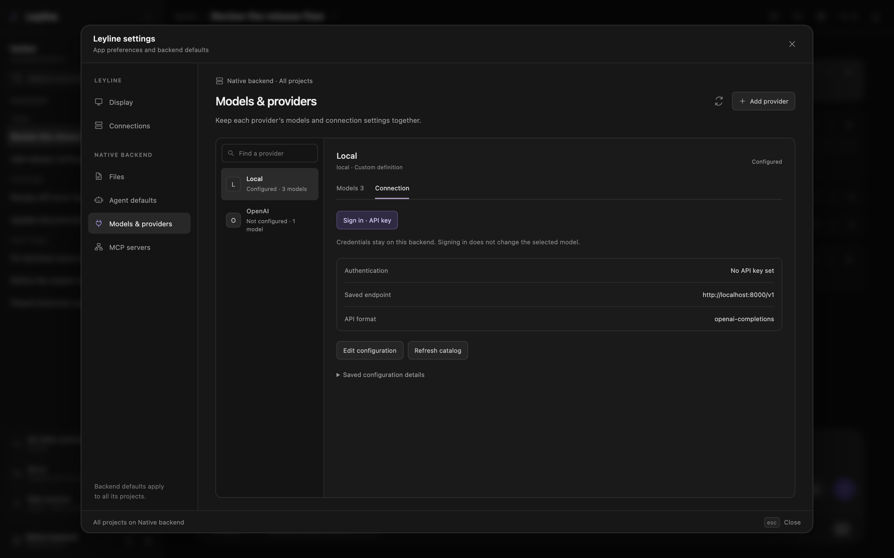
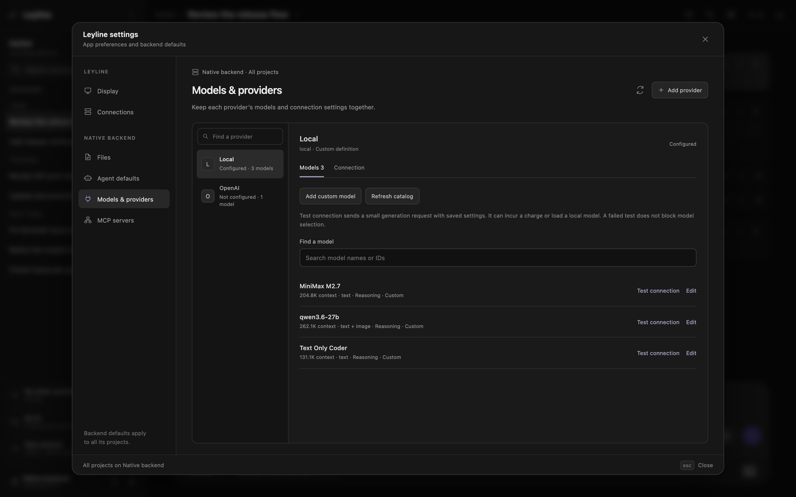
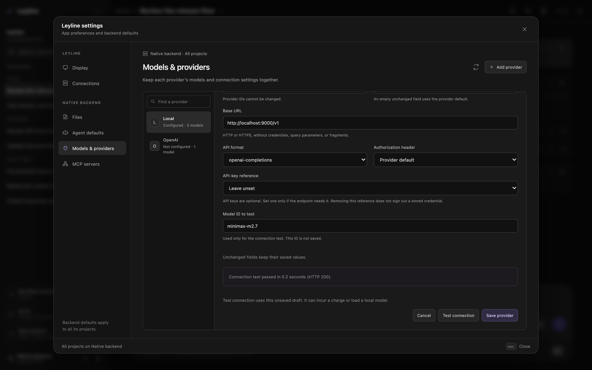
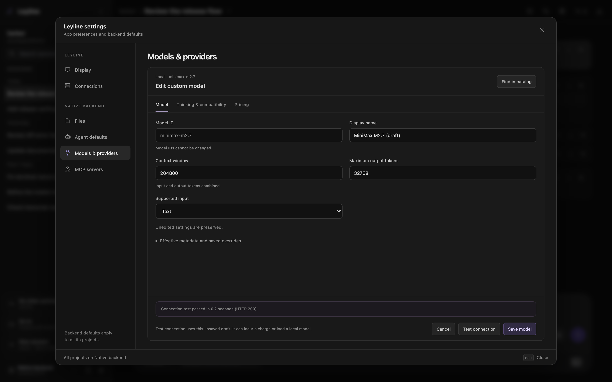
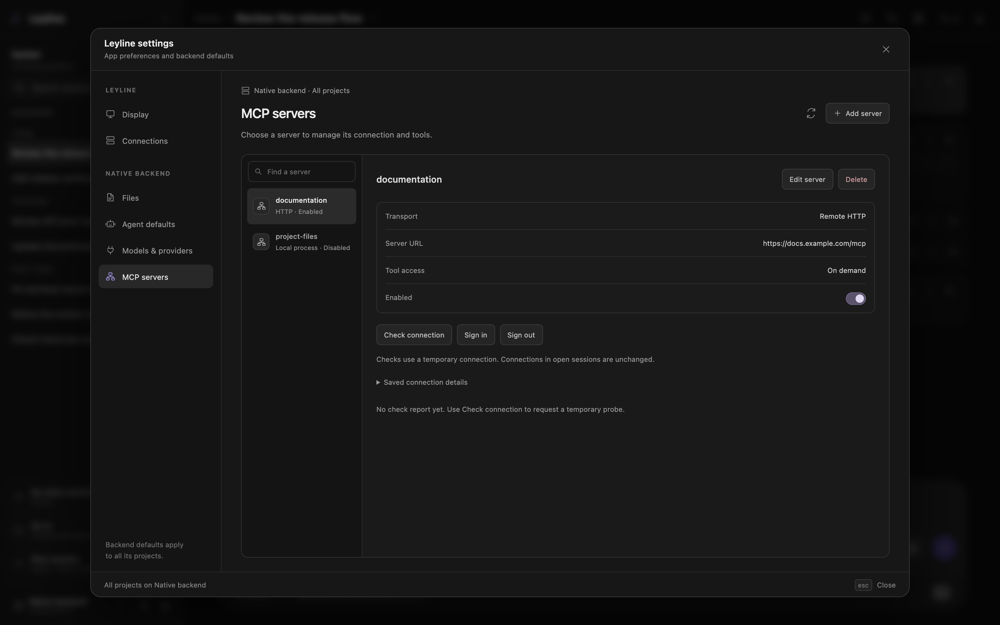
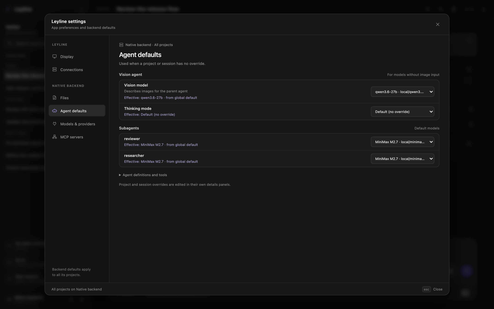
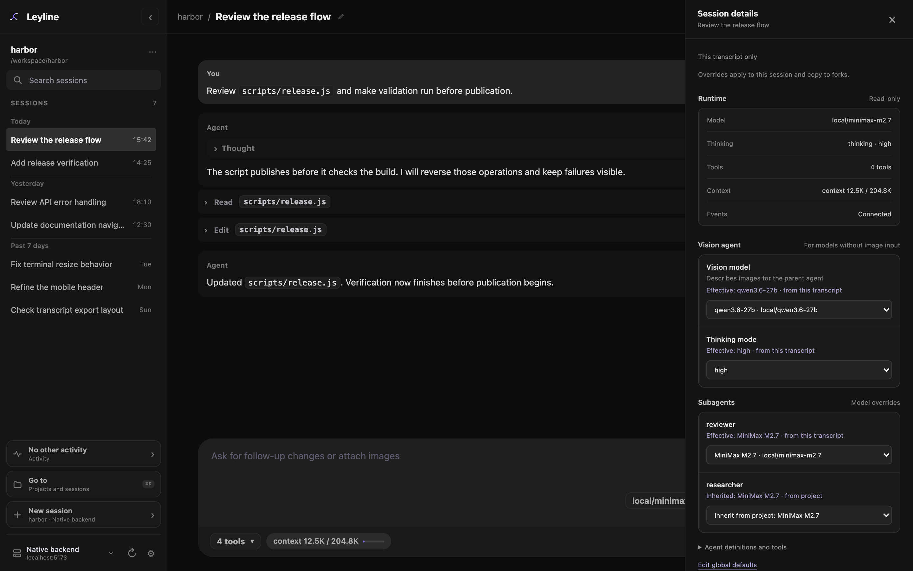

# Settings

**Settings** manages app preferences and defaults for the selected backend. Project and session overrides have separate drawers.

## Open Settings

Select **Open settings** at the bottom of the sidebar. In Electron, use **Settings…**, **Command+,** on macOS, or **Ctrl+,** on Linux.

The modal has these categories:

| Category | Applies to |
| --- | --- |
| **Display** | Transcript display across Leyline windows. |
| **Connections** | Saved backend connections and the default connection. Each window selects its own active backend. |
| **Files** | File actions on the selected backend. |
| **Agent defaults** | Global subagent and vision defaults on the selected backend. |
| **Models & providers** | Pi provider credentials, custom providers, model definitions, and catalog overrides on the selected backend. |
| **MCP servers** | Pi's global MCP configuration on the selected backend. |

**Files**, **Models & providers**, and **MCP servers** appear only when the selected backend supports them. On narrow screens, use **Category** to select a page.

Global pi configuration stays in pi's files. Leyline stores its display preferences, connections, and subagent/vision overrides separately. See [Configuration storage](../reference/environment#pi-configuration-storage).

## Manage backend connections

Open **Connections** to see the native backend and each saved connection. The native backend supplied the current Leyline app. You cannot edit or remove it.

To add a connection:

1. Select **Add connection**.
2. Enter a name.
3. Enter the backend URL.
4. Select **Test**.
5. Select **Save**.

The URL must use `http` or `https`. It can contain a hostname, an IP address, a port, and a base path. Do not add `/api/pi`; Leyline adds that path.

Each saved connection has these actions:

- **Use**: Select the backend for the current window.
- **Test**: Check the server identity and API version.
- **Make default**: Select the backend for fresh windows.
- **Edit**: Change the connection name or URL.
- **Remove**: Delete a connection that is not active in the current window.

Saved connections and the default are app-wide. New Electron windows inherit the source window's active backend unless you open a different backend in that window.

Command-click, Ctrl-click, or middle-click a backend choice in the sidebar or **Connections** to open Home on that backend. Electron opens a new window and leaves the source window unchanged.

When you select another backend in the current window, Leyline reloads that window. An active agent run continues on the previous backend. Leyline clears an unsent composer draft after confirmation.

::: warning
The Leyline backend API does not have authentication. Do not expose the server to an untrusted network. Settings routes can change credentials and execute configured commands.
:::

For remote browser access, configure the server to allow the frontend origin. See [Environment variables](../reference/environment).

## Manage models and providers

Open **Models & providers**. Select a provider in the searchable list, or use the **Provider** selector on a narrow screen. Each provider has **Models** and **Connection** tabs.

The list includes built-in providers, custom configuration, and providers from extensions available in the current project. Configuration changes apply globally on the selected backend.

API keys are optional for custom compatible endpoints. Leave the key unset when the endpoint does not need one. Leyline does not require a placeholder key.

### Sign in to a provider

1. Select the provider.
2. Open **Connection**.
3. Select the applicable **Sign in** method.
4. Follow pi's prompts in the Settings panel.
5. Open the authorization link if the provider requests browser login.

Credentials stay on the selected backend. Saved secrets do not appear in the provider details. Authentication prompts and replies do not enter the conversation transcript or Runtime events.

**Configured** means saved configuration or credentials are available. It does not confirm account access. Use [Test connection](#test-a-model-connection) to check a model request. Sign-in does not select a model. Use the composer to change the active model.

Use **Sign out** to remove the saved credential through pi. Environment credentials and API-key references can still apply. Removing a reference from `models.json` does not sign out a stored credential.

If a runtime retains older provider URLs, Leyline rejects sign-in before it saves new credentials. Pi shares credentials across sessions. Without this check, an older runtime could send new credentials to a previous endpoint.

Wait for active work to finish, then reload each affected session and retry. A backend restart also clears old runtimes, but clears pending **Up next** tasks. See [Sign-in safety](../reference/troubleshooting#provider-sign-in-is-blocked-after-an-endpoint-change).

### Add or edit a custom provider

1. Select **Add provider**.
2. Enter a unique **Provider ID** without spaces or `/`.
3. Enter the **Base URL** and select the **API format**.
4. Set the display name, authorization-header behavior, or API-key reference as needed.
5. Select **Save provider**.

The base URL must use HTTP or HTTPS without credentials, query parameters, or a fragment. To change an existing provider, open **Connection**, then select **Edit configuration**. Existing provider IDs cannot change.

Saving a provider does not add model definitions. Open **Models**, then select **Add custom model** to add a model. The provider form's **Model ID to test** checks a model without saving its definition.

An API-key reference accepts `$NAME`, `${NAME}`, a literal key, or `!command`. A bare `NAME` is a literal key. Commands execute on the backend when pi resolves the value. Use only commands that you trust.

Saved references stay hidden. Keep the current reference, replace it, or remove it explicitly. Unchanged fields keep their saved values.

**Remove provider configuration** removes the saved configuration, including fields outside this form. It does not remove built-in or extension definitions, or sign out stored credentials.

Pi 0.99.1 can retain cached model URLs after a Radius gateway URL changes. Leyline therefore rejects changes to existing Radius gateway URLs. Configure a different provider ID through pi for a different gateway. This editor does not create Radius OAuth configuration.

### Manage model definitions and overrides

Open **Models** to search model names or IDs.

- **Add custom model** creates a definition for an endpoint. Set the provider's base URL and API format first.
- **Override** changes metadata for a catalog model.
- **Edit** changes an existing custom definition or override.
- **Reset override** removes all saved overrides for that model, including fields outside the form.
- **Delete custom model** removes the custom definition.

The form supports display name, context window, maximum output tokens, reasoning support, input types, and token costs. Costs use USD per million tokens. Model IDs can contain `/` and must match the endpoint. An existing model ID cannot change.

Only changed fields are written. Unknown fields, compatibility options, and nested pricing tiers stay intact. A save or deletion fails if it leaves invalid model configuration.

**Refresh catalog** requests the provider's catalog through pi. The **Refresh** button beside **Models & providers** reloads the settings view and extension registrations. Neither action reloads open conversation runtimes.

On Home, saved changes refresh the model choices. Valid explicit model and thinking selections remain selected. For an existing session, use [Reload runtime](#reload-the-runtime).

Model-picker visibility controls and other pi settings are not part of this page.

### Test a model connection

**Test connection** sends a short generation request through the selected backend. It is optional. A failed test does not block saving or model selection.

To test saved settings, open **Models** and select **Test connection** beside the model.

To test a provider before saving:

1. Open **Add provider** or **Edit configuration**.
2. Enter the connection settings.
3. Enter an endpoint model ID in **Model ID to test**.
4. Select **Test connection** beside **Save provider**.

The model editor also has **Test connection** beside **Save model** or **Save override**. It uses the current **Model ID** and unsaved form values.

Progress, **Cancel**, and the result appear above the editor's Save/Test controls. The form keeps its unsaved values. Changing a field clears the previous result.

A test does not save form values, select a model, reload a live session, or add conversation messages. Removing a draft key reference still preserves stored credentials. Native OAuth can refresh saved tokens during a test; cancellation cannot undo that refresh.

Tests request up to 16 output tokens, disable automatic retries, and allow 30 seconds for the probe after settings runtime setup. A test can incur a charge or load a local model. Success confirms the short request, not every model capability.

This pi version cannot enforce those limits for:

- Codex models using `openai-codex-responses`.
- Direct OpenAI Responses with ChatGPT-subscription authentication.
- `openai-responses` models with `supportsMaxOutputTokens: false`.
- Bedrock, whose native automatic retries cannot be disabled.

Leyline explains why a test is unavailable before it sends the test generation request. These limits do not prevent normal model use.

Virtual model tests route to a physical model first. Provider editors require a physical **Model ID to test**. Draft endpoint or API changes cannot use a stored OAuth login. Tests can also be blocked by the [provider URL safety check](../reference/troubleshooting#provider-sign-in-is-blocked-after-an-endpoint-change).

## Manage MCP servers

Open **MCP servers** to manage pi's global `mcp.json` on the selected backend. Opening the page lists configuration without starting server connections.

### Add or edit a server

1. Select **Add server**.
2. Enter a name with letters, digits, underscores, or hyphens.
3. Select **Remote HTTP** or **Local process (stdio)**.
4. Enter the server URL or command.
5. Set tool exposure, timeout, and enabled state as needed.
6. Select **Save server**.

For stdio, enter one argument per line without shell quotes. The command runs on the selected backend, which can be a different computer. **Working directory** and environment variables apply to that process.

HTTP servers can use request headers and **Advanced OAuth configuration**. Native OAuth requires a compatible HTTP server without a configured `Authorization` header. The advanced fields do not establish OAuth support by themselves.

Tool exposure has these options:

- **Deferred (tool search)**: Pi discovers tools on demand through tool search.
- **Direct (always available)**: Tools enter the normal tool list.
- **Hidden**: Tools stay outside model discovery.

Leyline does not load Codemode. Existing pi exposure values outside these options remain unchanged unless you select another value.

Use **Edit server** to change a server. Its saved name cannot change. Changing transport removes fields that belong to the previous transport. The form lists those fields before you save.

Saved arguments, header values, environment values, and client secrets stay hidden. Blank replacement values keep saved secrets and arguments. Use the explicit removal controls to delete them.

Saving, deleting, or changing **Enabled** does not start or stop connections in open sessions. Reload those sessions to apply the configuration.

### Check a connection or sign in

Select **Check connection** to open a temporary connection and inspect the reported tools. For stdio, this starts the configured command on the selected backend. A check can connect a disabled server without changing its saved enabled state.

**Last check** describes the temporary connection. It does not show the health of connections in open sessions. Diagnostic text excludes raw server output that could contain secrets.

For an eligible HTTP server, select **Sign in** and follow pi's prompts. **Sign out** removes native OAuth credentials without requiring a live connection. Aliases for the same normalized server URL share native OAuth credentials.

**Cancel** stops the settings operation and closes its temporary resources. It cannot undo credential changes that pi already saved. Reload open sessions after authentication or configuration changes.

## Handle external configuration changes

Leyline preserves unknown fields, JSONC comments in `models.json`, and configuration symlinks. It checks each file's revision before a save or draft connection test.

If another process changes the file, the save fails instead of overwriting that edit. Refresh settings, review the current values, and apply the change again. Refresh asks before it discards unsaved form changes.

## Configure file actions

Open **Files** when the selected backend supports file actions.

1. Enter an **Editor command**, such as `code --wait` or `nvim`.
2. Select **Open editor in**: **Automatic**, **Desktop**, or **Leyline terminal**.
3. Select **Save**.

Leave the command blank to use `$EDITOR` on that backend. **Automatic** uses the Leyline terminal for recognized terminal editors. **Desktop** launches the editor on the backend's desktop.

Leyline appends the file path to the command. Optional arguments are supported, but shell operators and substitutions are not. File actions run on the selected backend. A remote backend does not launch an editor on the browser's computer.

See [Images and previews](./images-and-previews#preview-a-local-file) for local file links and outside-project approval.

## Set the thought display default

1. Open **Display**.
2. For **Thoughts**, select **Collapsed** or **Expanded**.

The setting controls the initial state of each new **Thought** or **Thinking** row. If no setting is saved, Leyline uses **Collapsed**. Existing rows keep their current state. This setting does not change the model's thinking level.

## Manage the vision agent

Open **Agent defaults** to set the vision model for all projects on the selected backend. Under **Vision agent**, select an image-capable **Vision model**. If **Thinking mode** appears, select a level or **Match parent session**.

Project and session overrides use their own surfaces:

- **Project actions → Project settings → Settings**: Override values for that project.
- **Session details** in the workbench header: Override values for the current session. Forks copy these overrides.

Model and thinking values inherit independently, in session, project, then global order. The displayed effective value starts at the scope of the open surface. A global default does not include a project or session override.

Select the inherited option to remove a project or session override. In **Agent defaults**, **None configured** removes the global model. **Default (no override)** removes its thinking value.

Before a session exists, configure global defaults or project overrides. Session overrides require a selected session.

When the active model cannot receive images, Leyline tells it to call `vision_agent`. See [Images and previews](./images-and-previews) for image handling and storage.

## Manage subagent models

Open **Agent defaults** and find **Subagents** to set global model defaults. Use **Project settings** or **Session details** for narrower overrides. See [Subagents](./subagents) for precedence and inheritance.

## Inspect runtime state

Select **Session details** in the workbench header. In Electron on macOS, **Command+Shift+E** opens or closes this drawer. The shortcut does nothing on Home.

The **Runtime** section shows the model, thinking level, enabled tool count, context usage, and event connection state. These values are read-only. Change the active model and thinking level in the composer.

## Inspect session state

Scroll to **Session** in **Session details** to see the project, session ID, CWD, path, and message count. Use **Copy session ID**, **Copy CWD**, or **Copy path** to copy a value.

For project metadata and session management, open [Project settings](./projects-and-search#open-project-settings).

## Reload the runtime

**Reload runtime** is at the bottom of the sidebar, beside **Open settings**. Provider and MCP save notices also offer **Reload selected session** when the selected session is idle.

Reload recreates the selected runtime with current pi resources and configuration. It does not reload every open or background session. Reload is disabled without a selected session or during active work.

Pending **Up next** tasks stay held after reload. Select **Resume** when you are ready to send them. A backend restart clears those unsent tasks.
