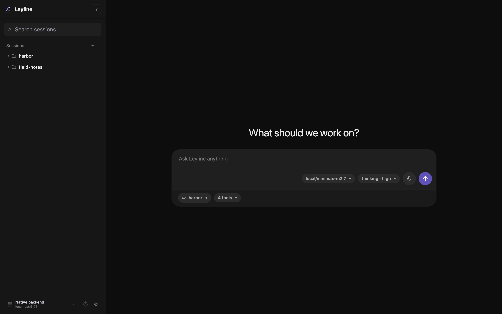

# Start screen

The start screen appears when no session is selected. One submission can create a session and send its first prompt.

*The start screen stages project and runtime choices before session creation.*

## Select a project

1. Select the project name below the composer.
2. Enter text in **Search projects** to filter the project list.
3. Select a project.

The project control shows **Choose project** when no project is selected.

To use a different folder, select **Add new project**. The **Add project folder** browser opens.

## Add a project folder

1. Enter an absolute path, `~/` path, or relative path.
2. Use **Arrow Up** or **Arrow Down** to move the highlight.
3. Press **Enter** to open the highlighted folder.
4. Press **Command+Enter** or **Ctrl+Enter** to add the typed path.

Select **Home** to return to your home folder. Press **Escape** or select **Cancel** to close the browser.

If the typed folder does not exist, the action changes to **Create & add**. Leyline creates that folder when you confirm the action.

## Select the model and thinking level

1. Select the model control.
2. Enter text in **Filter models** if the list is long.
3. Select a model.
4. Select the thinking control.
5. Select an available thinking level.

These choices are staged for the new session. A model change can also change the available thinking levels.

## Inspect enabled tools

Select the tool-count control, such as **12 tools**. The **Enabled tools** list shows the tools for the staged runtime.

The list is read-only. It can show **0 tools** when no tools are enabled.

## Send the first prompt

1. Select a project.
2. Enter the first task in **Ask Leyline anything**.
3. Press **Enter** or select the send button.

Leyline creates the session first. It then applies the staged model and thinking level and submits the prompt.

Press **Shift+Enter** to add a line break.

## Paste images

Paste one or more images into the composer. Leyline adds each image to the attachment tray.

Select the **×** on an attachment to remove it. Leyline shows a warning when the staged model does not support images.

Leyline accepts PNG, JPEG, GIF, and WebP image data. The current composer has no fixed count or byte limit.

## Use dictation

Select **Start dictation** to add recognized speech to the draft. Select **Stop dictation** to stop.

Dictation uses the browser Web Speech API. The control is disabled in Electron and in unsupported browsers.

## Select a slash command

1. Enter `/` followed by part of a command name.
2. Use **Arrow Up** or **Arrow Down** to select a result.
3. Press **Tab** or **Enter** to insert the command.

The list identifies each item as **Command**, **Prompt**, or **Skill**. Press **Escape** to close the list.

## Run a shell command

Start the draft with `!` or `!!`.

- `! command` runs the command and includes its output in session context.
- `!! command` runs the command and excludes its output from session context.

The composer shows **shell · context** or **shell · hidden**. Shell commands cannot include image attachments.
