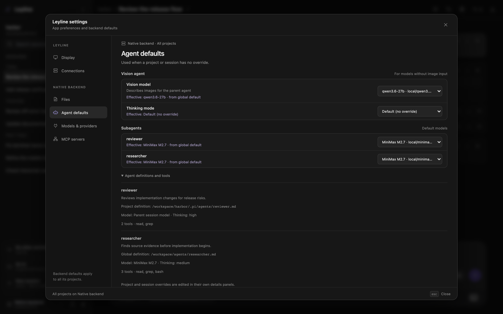

# Manage subagents

Subagents run delegated tasks in child sessions with separate context.

*Each subagent row shows the model and its source at the scope you are editing.*

## Open subagent settings

1. Select **Open settings** at the bottom of the sidebar.
2. Select **Agent defaults**.
3. Find **Subagents**.

The list includes project and global agent definitions. Expand **Agent definitions and tools** for descriptions, source paths, model and thinking defaults, and tool lists.

Deep research uses a reserved bundled `researcher`. It does not appear in this list and inherits the parent model and thinking level by default.

## Select a model scope

The surface determines the scope:

- **Settings → Agent defaults** supplies global defaults for projects on the selected backend.
- **Project actions → Project settings → Settings** changes defaults for that project.
- **Session details** in the workbench header changes only the selected session. Forks copy this override.

Select a model in the subagent row. The option label contains the model name and `provider/model-id`.

Select the inherited option to remove a project or session override. In **Agent defaults**, select **Use agent definition** to remove the global override.

Select **Parent session model** to store `inherit`. The child uses the parent session model when that override applies.

The **Effective** or **Inherited** text shows the result from the displayed scope and its broader defaults. A global view does not include project or session overrides.

## Understand model precedence

Leyline selects a child model in this order:

1. A model requested for the specific subagent tool call.
2. The session override.
3. The **Project** override.
4. The **Global** override.
5. The model in the agent definition.
6. The child runtime default.

An applicable `inherit` value uses the parent session model.

## Understand thinking precedence

Subagent settings manage model overrides only. Thinking comes from the subagent request or agent definition.

A thinking level requested for one child run takes priority. Otherwise, the agent definition applies. The child runtime default applies when neither value exists.

The `inherit` thinking value uses the parent session thinking level.

## Understand execution modes

The agent can use three subagent modes:

- **single** runs one agent for one task.
- **parallel** runs task groups concurrently, with up to four tasks in each batch.
- **chain** runs steps in order and replaces `{previous}` with the prior output.

A model or thinking value on one task takes priority over the mode-level value.

## Read a subagent card

A subagent tool call appears as a card in the parent transcript. It shows the agent name, task results, and status.

Select the card to expand final output. Select **→ view session** to open a
child session. Use Command-click, Ctrl-click, or middle-click to open the child
in a new tab or window.

## Return to the parent session

Child sessions are hidden from the sidebar. Their header shows **← parent session**.

Select **← parent session** to return to the parent transcript. Use a modified
click to open the parent in a new tab or window.
