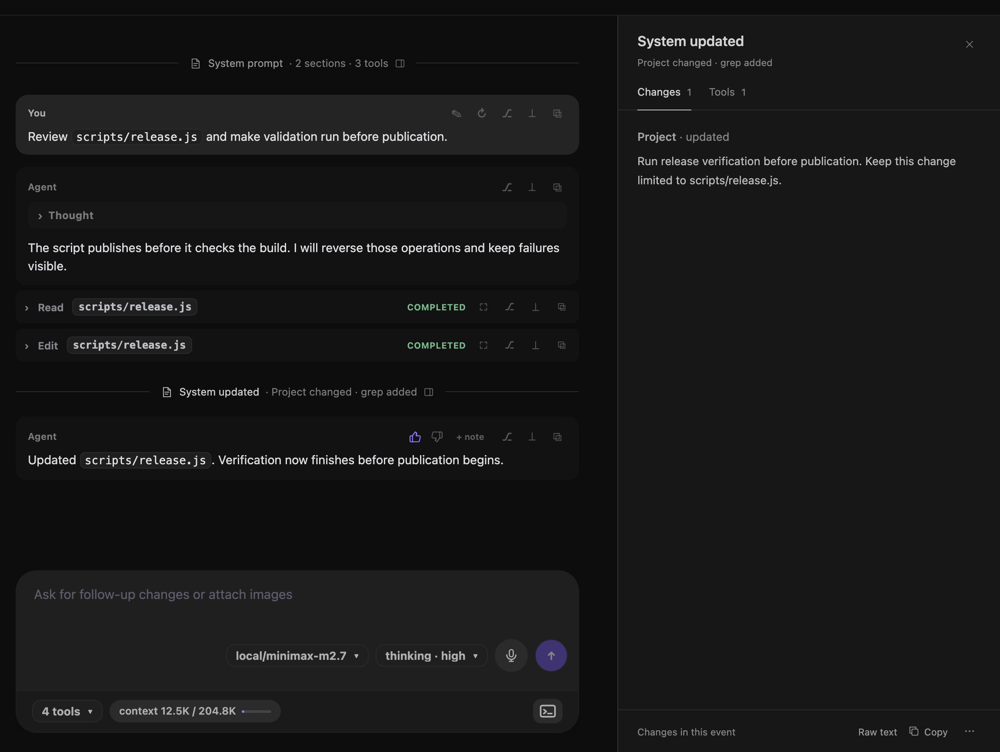

# Tools and thinking

The transcript separates assistant text, reasoning, System changes, tools, skills, subagents, and feedback.

## Expand a thought

Saved reasoning appears in a **Thought** row. During a live response, the row uses **Thinking**.

The setting in **Settings** controls how each new row starts. If no setting is saved, Leyline uses **Collapsed**.

To change the default state:

1. Open **Settings**.
2. Find **Display**.
3. For **Thoughts**, select **Collapsed** or **Expanded**.

The setting does not change a row that is already in the transcript. Select a row to expand or collapse it.

Saved assistant text appears as rendered Markdown. Raw HTML is disabled.

## Expand a tool row

Tool rows are collapsed by default. Select a row to show its output or preview.

Each row shows a tool label, target when available, and status. Common labels include file paths for file tools and commands for shell tools.

Shell rows also show **in context** or **not in context**. This label tells you whether pi received the command output as session context.

## Inspect System changes

Pi records the system prompt and tool declarations as System events. Each event appears as a muted, centered divider with a document icon and a short summary. Initial declarations show **System prompt**. Later changes show **System updated**. Older sessions can have no System events.

Select a divider to open the prompt inspector on the right:

- **Prompt** shows the initial prompt sections as rendered Markdown.
- **Changes** shows updated or removed sections for a later event. It does not reconstruct the full prompt at that point.
- **Tools** shows initial or added tools and their descriptions, plus removed tool names. An event with only tool changes opens this tab.

Select **Raw text** to see the exact event text without Markdown formatting. **Copy** copies that same text from either view. Select **Reading view** to return to the tabs.

For a saved event, the **System event actions** menu offers **Fork from here** and **Reset to here**. Reset is unavailable during an active run. Both actions are unavailable during a fork, reset, or compaction.

The inspector reserves transcript space on wide windows. On narrower windows, it overlays the right side. On mobile, it fills the width below the header and blocks interaction with the transcript.

The inspector cannot stay open beside **Review** or **Sources**. Select **Close prompt inspector** to close it. Escape closes the actions menu first, then the inspector. Selection stays open when a live event becomes a saved entry. The inspector closes when you change sessions or backends, or the event leaves the selected branch.

## Use MCP tools and confirmations

Leyline uses pi's native MCP integration for configured servers. MCP tools use names such as `mcp__<server>__<tool>`. Pi's exposure settings control how the model reaches them. Calls and results appear in the transcript like other tools.

See [Manage MCP servers](./settings#manage-mcp-servers) to configure servers in Settings.

When an extension requests confirmation, Leyline shows a card above the composer. Read the request, then select **Confirm** or **Cancel**. MCP tools use pi's tool pipeline, so permission extensions can request confirmation for them too. Not every tool call requires confirmation.

For a background session, **Activity** shows **Waiting for confirmation** under **Needs attention**. Open that session to reply.

## Open full tool output

Select **Open full screen** in an expanded tool row. You can also select its fullscreen action in the row header.

The fullscreen view shows the complete available output or preview. Markdown read results open in **Rendered** mode. Select **Source** to inspect the original text. The **Copy** action copies the source in both modes.

Select **×** or the backdrop to close the fullscreen view.

## Expand a skill row

A loaded skill prompt appears as a compact row with `[skill]`, the skill name, and **expand**. Select it to show the skill prompt payload.

Select the row again when it shows **hide**.

## Read a subagent card

A subagent tool call appears as a subagent card. The card shows the agent name and **running**, **completed**, or **error**.

Select the card to expand its result. Select **→ view session** on a result to open that child session.

## Copy transcript content

Select **Copy** in a message or tool header. Leyline copies the message text or available tool output.

The action changes to **Copied** for a short time. The fullscreen tool view also has a **Copy** action.

## Add rollout feedback

1. Point to an assistant message.
2. Select **Mark helpful** or **Mark not helpful**.
3. Select **+ note** to add optional details.
4. Enter the note.
5. Select **Save**.

Select the active rating again to clear it. Select **note** to change an existing note.

Leyline stores rollout ratings and notes in local Leyline data. They are separate from the session log.

## Follow live output

Leyline shows assistant and tool rows as the runtime produces them. Saved transcript rows replace the live rows after pi records the turn.

This change preserves your reading position and prevents duplicate output.
