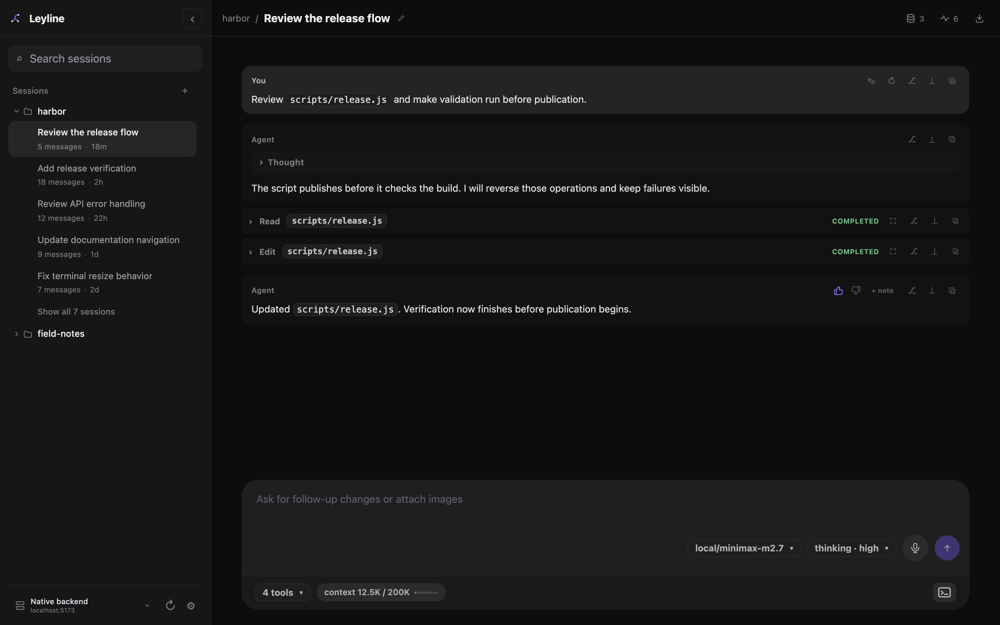

# Workbench

The workbench shows the selected session, live output, composer, drawers, and terminal.

*The selected session stays readable while live runtime controls remain available.*

## Use the session header

The desktop header shows the project and session as a breadcrumb. Select the session name to rename it.

A subagent child session also shows **← parent session**. Select this control to open its parent session.

The right side of the header contains these controls:

- **Memory** opens the Memory Inspector. Its count shows active visible memories.
- **Events** opens the Runtime events drawer. Its count shows retained runtime events.
- **Export transcript** downloads the session as HTML.

**Events** and **Export transcript** do not appear for an empty session.

## Read the transcript

The transcript shows the current session branch. User messages, assistant messages, tools, thoughts, skills, summaries, and images use different rows.

Assistant output and tool activity appear while the run is active. Saved rows replace live rows after pi records the turn. Leyline keeps one visible copy of each item.

## Keep your reading position

Leyline follows new output while the transcript is near the bottom. Scrolling up stops that automatic movement.

When new output arrives above your current position, Leyline shows **Jump to latest**. Select it to move to the newest output and resume automatic scrolling.

## Switch sessions during a run

Select another session or project at any time. A background runtime continues after you leave its transcript.

The sidebar shows the background runtime state. It marks completed background output as **unread**.

## Collapse the desktop sidebar

Select **Hide sessions** in the Leyline header. Select **Show sessions** to restore the sidebar.

The workbench expands into the available space while the sidebar is hidden.

## Open workbench drawers

Only one main right-side drawer is open at a time. Opening **Memory**, **Events**, **Settings**, **Subagents**, or **Project details** closes conflicting drawers.

The terminal is a bottom drawer. It can remain open while you use the transcript and composer.
