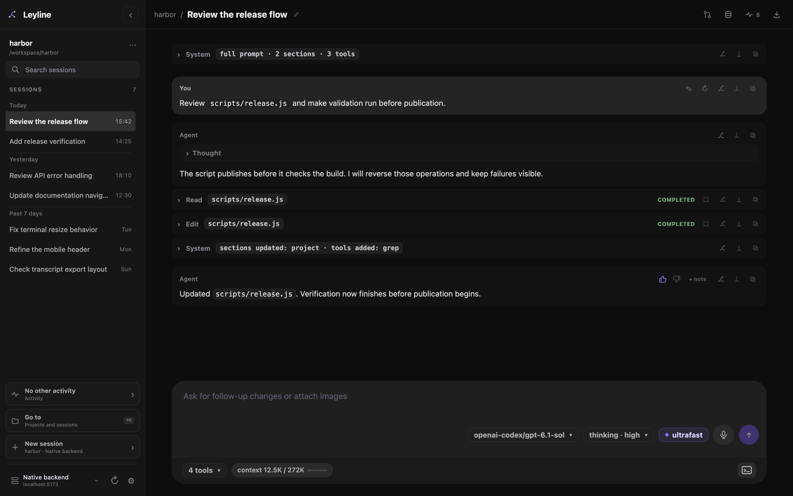

# Workbench

The workbench shows the selected session, live output, composer, drawers, and terminal.

*The selected session stays readable while live runtime controls remain available.*

## Use the session header

The desktop header shows the project and session as a breadcrumb. Select the session name to rename it.

A subagent child session also shows **← parent session**. Select this control to
open its parent session. Use Command-click, Ctrl-click, or middle-click to open
the parent in a new tab or window.

A research session shows its phase or **report ready** beside the title. Its source control opens cited sources and the complete research ledger.

The right side of the header contains these controls:

- **Review changes** opens the desktop [Git review pane](./git-review). It appears when the selected backend supports review.
- **Session details** opens runtime information, session metadata, and session-level agent overrides.
- **Memory** opens the Memory Inspector. Its count shows active visible memories.
- **Events** opens the Runtime events drawer. Its count shows retained runtime events.
- **Export transcript** downloads the session as HTML.

**Events** and **Export transcript** do not appear for an empty session.

## Read the transcript

The transcript shows the current session branch. Messages, tools, thoughts, skills, summaries, images, and System changes use different rows.

Muted **System** rows mark prompt and tool changes that pi recorded. Select a row to open the prompt inspector. Later rows show that event's changes, not a reconstructed full prompt. See [Tools and thinking](./tools-and-thinking#inspect-system-changes).

Assistant output and tool activity appear while the run is active. Saved rows replace live rows after pi records the turn. Leyline keeps one visible copy of each item.

A [deep research session](./deep-research) adds a phase bar, Research threads card, cited report artifact, source pane, and citation previews. Each thread can link to its child transcript.

## Reply to a confirmation

Extension confirmation cards appear above the composer. Read the request, then select **Confirm** or **Cancel**. A background session that needs a reply appears in **Activity** as **Waiting for confirmation**.

## Keep your reading position

Leyline follows new output while the transcript is near the bottom. Scrolling up stops that automatic movement.

When new output arrives above your current position, Leyline shows **Jump to latest**. Select it to move to the newest output and resume automatic scrolling.

## Switch sessions during a run

Select another session or project at any time. A background runtime continues after you leave its transcript.

The sidebar shows the background runtime state. It marks completed background output as **unread**.

## Collapse the desktop sidebar

Select **Hide sessions** in the Leyline header. Select **Show sessions** to restore the sidebar.

The workbench expands into the available space while the sidebar is hidden.

## Open workbench drawers

**Memory**, **Events**, **Project settings**, and **Session details** use focused drawers. Opening one closes conflicting drawers. The sidebar gear opens the global **Settings** modal. Subagent and vision controls appear within their applicable settings scope.

Git review, research sources, and the prompt inspector share the desktop right rail. Opening one closes the others. You can resize Git review or expand it across the workspace.

The terminal is a bottom drawer. It can remain open while you use the transcript and composer.
